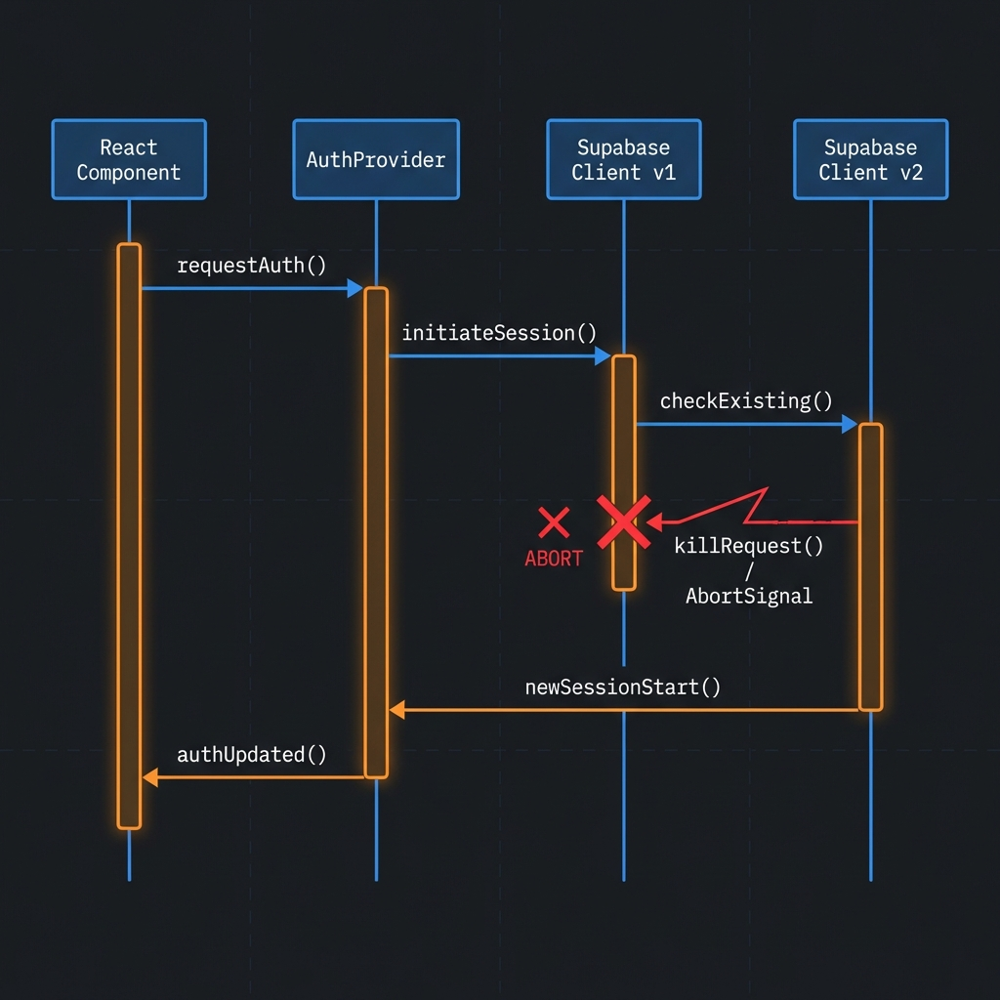

# Supabase SSR 踩坑实录：那个“莫名消失”的网络请求


_▲ 封面：探索 Supabase SSR 与 Next.js 的工程选择_

作者: Jerry (Beyond Frontend)
日期: 2026-01-20

## 0. 前情提要：我在做什么？

在开始技术排查之前，先聊聊我的项目背景。

我正在开发一个名为 **“设计百宝箱” (Design Treasure Box)** 的设计资源聚合平台。项目的核心逻辑很简单：

1. **SSG/ISR 渲染前端**：为了极速的加载体验，封面资源卡片主要采用服务端渲染。
2. **Supabase 驱动后端**：使用 Supabase 提供鉴权（Auth）和数据存储（PostgreSQL）。
3. **管理后台**：我作为管理员登录后，可以在 `/admin` 路径下进行资源审核和截图管理。

**问题就出在“前端”与“后台”的交界处。**

---

## 1. 问题现象：深夜的永久 Loading

最近在迭代项目时，我遇到了一个极其诡异的 Bug。

**场景复现：**
我在完成管理后台的配置后，点击右上角的“返回首页”，页面会陷入永久的 Loading 状态。

**诡异的差异：**

- ✅ **无痕模式**：一切正常。
- ❌ **登录态（正常模式）**：卡死在主内容区，首页的资源卡片一个也刷不出来。

原本以为又是环境变量 `NEXT_PUBLIC_` 注入失败的老剧本，但这次的坑，藏得比我想象中要深得多... 💀

---

## 2. 逻辑流转图：冲突是如何发生的？

为了直观理解这个 Bug，我画了一张逻辑流转图。请注意中间那个 **Abort (中止)** 信号：


_▲ 示意：新旧 Supabase 实例在初始化时的“互杀”行为_

从图中可以看到，当组件频繁重新渲染时：

1. **AuthProvider** 触发了第二次渲染。
2. 创建了 **Supabase Client v2**。
3. **v2** 在启动时，为了防止冲突，会静默中止（Abort） **v1** 正在进行的网络请求。
4. 结果：首页的资源请求在发出前一秒，就被“自己人”干掉了。

---

## 3. 排查过程：追踪消失的 Query

### 3.1 排除环境变量干扰

我首先在控制台直接调用 Supabase REST API，确认秘钥和 URL 没问题：

```javascript
// 手动验证 REST 接口
const response = await fetch('https://xxx.supabase.co/rest/v1/resources?select=id&limit=3', {
  headers: { apikey: 'your-anon-key' },
});
console.log(await response.json()); // ✅ 正常返回！
```

### 3.2 Loading 状态到底卡在哪？

首页的资源是通过 TanStack Query 异步获取的，Loading 状态由以下代码控制：

```tsx
// components/home-page.tsx
if (isInitialLoading && resources.length === 0) {
  return <Loader2 className="animate-spin" />; // 💀 永远停在这里
}
```

### 3.3 关键线索：AbortError

在 `queryFn` 中埋点，我终于抓到了真凶：

```json
{
  "error": "AbortError: signal is aborted without reason"
}
```

**真相大白：请求不是失败了，而是被中止了。** 而且因为是“无理由中止”，导致 Promise 永远处于 Pending 状态，TanStack Query 以为还在加载中。

---

## 4. 根因拆解：生命周期的致命节奏

### 4.1 犯罪现场代码

罪魁祸首隐匿在 `AuthProvider`：

```tsx
// components/auth-provider.tsx
export function AuthProvider({ children }) {
  // ❌ 每次重渲染都在执行 createClient()
  const supabase = createClient();

  useEffect(() => {
    // ⚠️ supabase 实例的变化触发了 Effect 的频繁重启
    const { data: { subscription } } = supabase.auth.onAuthStateChange(...);
    return () => subscription.unsubscribe();
  }, [supabase]);
}
```

### 4.2 为什么只在登录后发生？

因为登录后，用户信息存在 LocalStorage/Cookie 中。

1. React 在挂载页面时，**Strict Mode** 会触发双次渲染。
2. 第一次渲染创建 Client v1 并发起请求。
3. 第二次渲染紧随其后，创建 Client v2。
4. **@supabase/ssr** 的机制导致 v2 中止了 v1。

---

## 5. 解决方案：从 useMemo 到单例模式

### 5.1 方案一：useMemo 包装（针对局部）

确保客户端实例在组件生命周期内唯一。

```tsx
// ✅ 仅在挂载时初始化一次
const supabase = useMemo(() => createClient(), []);
```

### 5.2 方案二：全局单例模式（工程化首选）


_▲ 示意：单例模式确保全局只有一个稳定的资源实例_

在全局库层面确保唯一性：

```typescript
// lib/supabase/client.ts
let supabaseClient: SupabaseClient | null = null;

export function createClient() {
  if (supabaseClient) return supabaseClient;

  supabaseClient = createBrowserClient(
    process.env.NEXT_PUBLIC_SUPABASE_URL!,
    process.env.NEXT_PUBLIC_SUPABASE_ANON_KEY!
  );
  return supabaseClient;
}
```

---

## 6. 避坑指南

| 坑点           | 本质                 | 应对攻略               |
| :------------- | :------------------- | :--------------------- |
| **AbortError** | 多实例竞态           | 强制单例模式           |
| **无请求记录** | 逻辑层拦截早于网络层 | 检查 Client 实例化频率 |

### 💡 核心教训

1. **外部资源单例化**：在客户端组件中，外部库实例必须严格管理。
2. **警惕 Effect 依赖**：不要把每次渲染都生成的新对象放入依赖数组。

---

## 写在最后

Supabase 的便利性让我很容易忽略底层的复杂性。

在 Next.js 的混合渲染模式下，**理解代码运行的环境（Server vs Client）以及它们各自的生命周期**，比记住几个 API 调用重要得多。

希望这次我的“流血经验”能帮大家少走弯路。🚀

---

👨‍💻 **前端之外**
写前端，也拆 AI

#前端工程 #Supabase #Nextjs #避坑指南
