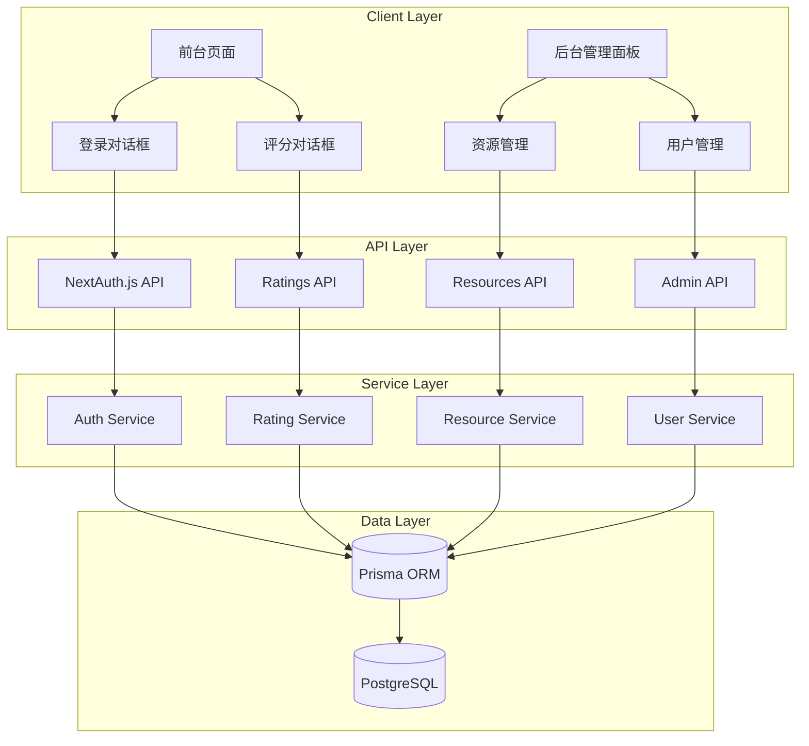

# Design Document: Admin and Rating System

## Overview

本设计文档描述了"设计百宝箱"应用的后台管理系统和用户评分功能的技术实现方案。系统将在现有 Next.js 16 应用中集成以下功能：

1. **OAuth 认证系统**：使用 NextAuth.js 实现 Google 和 GitHub 登录
2. **用户角色管理**：区分普通用户和管理员权限
3. **前台评分功能**：已登录用户可以对资源进行多维度评分
4. **后台管理面板**：管理员可以管理资源内容
5. **数据持久化**：使用 Prisma + PostgreSQL 存储用户和评分数据

## Architecture

### 技术栈选择

**认证层：**

- Supabase Auth - OAuth 认证和会话管理
- Google OAuth Provider
- GitHub OAuth Provider

**数据层：**

- Supabase PostgreSQL - 托管数据库
- Supabase Client - 数据库查询和实时订阅

**API 层：**

- Next.js API Routes - RESTful API 端点
- Supabase Row Level Security (RLS) - 数据库级别的权限控制

**前端层：**

- 现有技术栈：React 19 + TypeScript + Tailwind CSS + shadcn/ui
- 新增组件：登录对话框、评分对话框、管理员面板
- Supabase Client - 前端数据访问

**管理后台模板：**

- Vercel 官方模板 - `vercel/nextjs-postgres-nextauth-tailwindcss-template`
- 复用布局、导航、表格等通用组件
- 适配 Supabase Auth 和 Supabase PostgreSQL
- shadcn/ui 官方示例 - 仪表板、图表组件

### 系统架构图



### 目录结构

```
design-treasure-box/
├── app/
│   ├── api/
│   │   ├── resources/
│   │   │   ├── route.ts              # 资源列表 API
│   │   │   └── [id]/
│   │   │       └── route.ts          # 单个资源 API
│   │   ├── ratings/
│   │   │   ├── route.ts              # 评分提交 API
│   │   │   └── [resourceId]/
│   │   │       └── route.ts          # 资源评分查询 API
│   │   └── admin/
│   │       ├── resources/
│   │       │   └── route.ts          # 管理员资源管理 API
│   │       └── users/
│   │           └── route.ts          # 管理员用户管理 API
│   ├── admin/
│   │   ├── layout.tsx                # 管理员布局
│   │   ├── page.tsx                  # 管理员仪表板
│   │   ├── resources/
│   │   │   ├── page.tsx              # 资源列表页
│   │   │   ├── new/
│   │   │   │   └── page.tsx          # 新建资源页
│   │   │   └── [id]/
│   │   │       └── edit/
│   │   │           └── page.tsx      # 编辑资源页
│   │   └── users/
│   │       └── page.tsx              # 用户管理页
│   └── ...                           # 现有前台页面
├── components/
│   ├── auth/
│   │   ├── login-dialog.tsx          # 登录对话框
│   │   ├── user-menu.tsx             # 用户菜单
│   │   └── auth-provider.tsx         # Supabase 认证上下文
│   ├── rating/
│   │   ├── rating-dialog.tsx         # 评分对话框
│   │   ├── rating-display.tsx        # 评分显示组件
│   │   └── rating-input.tsx          # 评分输入组件
│   ├── admin/
│   │   ├── admin-nav.tsx             # 管理员导航
│   │   ├── resource-form.tsx         # 资源表单
│   │   ├── resource-table.tsx        # 资源表格
│   │   └── user-table.tsx            # 用户表格
│   └── ...                           # 现有组件
├── lib/
│   ├── supabase/
│   │   ├── client.ts                 # Supabase 客户端（浏览器）
│   │   ├── server.ts                 # Supabase 客户端（服务器）
│   │   └── middleware.ts             # Supabase 中间件
│   ├── api/
│   │   ├── resources.ts              # 资源 API 客户端
│   │   ├── ratings.ts                # 评分 API 客户端
│   │   └── admin.ts                  # 管理员 API 客户端
│   └── ...                           # 现有工具函数
├── supabase/
│   ├── migrations/                   # 数据库迁移（SQL）
│   └── seed.sql                      # 数据库种子数据
├── types/
│   ├── auth.ts                       # 认证相关类型
│   ├── rating.ts                     # 评分相关类型
│   ├── database.ts                   # Supabase 生成的数据库类型
│   └── ...                           # 现有类型定义
└── ...
```

## Components and Interfaces

### 数据库模型（Supabase SQL Schema）

```sql
-- supabase/migrations/001_initial_schema.sql

-- 启用 UUID 扩展
CREATE EXTENSION IF NOT EXISTS "uuid-ossp";

-- 用户角色枚举
CREATE TYPE user_role AS ENUM ('USER', 'ADMIN');

-- 用户表（扩展 Supabase Auth 的 auth.users）
CREATE TABLE public.profiles (
  id UUID PRIMARY KEY REFERENCES auth.users(id) ON DELETE CASCADE,
  name TEXT,
  email TEXT UNIQUE NOT NULL,
  image TEXT,
  role user_role DEFAULT 'USER' NOT NULL,
  created_at TIMESTAMPTZ DEFAULT NOW() NOT NULL,
  updated_at TIMESTAMPTZ DEFAULT NOW() NOT NULL
);

-- 资源表
CREATE TABLE public.resources (
  id UUID PRIMARY KEY DEFAULT uuid_generate_v4(),
  name TEXT NOT NULL,
  url TEXT NOT NULL,
  description TEXT NOT NULL,
  category_id TEXT NOT NULL,
  tags TEXT[] NOT NULL,
  curator_note TEXT NOT NULL,
  is_featured BOOLEAN DEFAULT FALSE NOT NULL,
  curator_rating JSONB NOT NULL,
  view_count INTEGER DEFAULT 0 NOT NULL,
  favorite_count INTEGER DEFAULT 0 NOT NULL,
  created_at TIMESTAMPTZ DEFAULT NOW() NOT NULL,
  updated_at TIMESTAMPTZ DEFAULT NOW() NOT NULL
);

-- 用户评分表
CREATE TABLE public.ratings (
  id UUID PRIMARY KEY DEFAULT uuid_generate_v4(),
  user_id UUID NOT NULL REFERENCES public.profiles(id) ON DELETE CASCADE,
  resource_id UUID NOT NULL REFERENCES public.resources(id) ON DELETE CASCADE,
  overall DECIMAL(2,1) NOT NULL CHECK (overall >= 0 AND overall <= 5),
  usability DECIMAL(2,1) NOT NULL CHECK (usability >= 0 AND usability <= 5),
  aesthetics DECIMAL(2,1) NOT NULL CHECK (aesthetics >= 0 AND aesthetics <= 5),
  update_frequency DECIMAL(2,1) NOT NULL CHECK (update_frequency >= 0 AND update_frequency <= 5),
  free_level DECIMAL(2,1) NOT NULL CHECK (free_level >= 0 AND free_level <= 5),
  comment TEXT,
  created_at TIMESTAMPTZ DEFAULT NOW() NOT NULL,
  updated_at TIMESTAMPTZ DEFAULT NOW() NOT NULL,
  UNIQUE(user_id, resource_id)
);

-- 索引
CREATE INDEX idx_profiles_email ON public.profiles(email);
CREATE INDEX idx_profiles_role ON public.profiles(role);
CREATE INDEX idx_resources_category ON public.resources(category_id);
CREATE INDEX idx_resources_featured ON public.resources(is_featured);
CREATE INDEX idx_ratings_user ON public.ratings(user_id);
CREATE INDEX idx_ratings_resource ON public.ratings(resource_id);

-- 自动更新 updated_at 触发器
CREATE OR REPLACE FUNCTION update_updated_at_column()
RETURNS TRIGGER AS $$
BEGIN
  NEW.updated_at = NOW();
  RETURN NEW;
END;
$$ LANGUAGE plpgsql;

CREATE TRIGGER update_profiles_updated_at
  BEFORE UPDATE ON public.profiles
  FOR EACH ROW
  EXECUTE FUNCTION update_updated_at_column();

CREATE TRIGGER update_resources_updated_at
  BEFORE UPDATE ON public.resources
  FOR EACH ROW
  EXECUTE FUNCTION update_updated_at_column();

CREATE TRIGGER update_ratings_updated_at
  BEFORE UPDATE ON public.ratings
  FOR EACH ROW
  EXECUTE FUNCTION update_updated_at_column();

-- Row Level Security (RLS) 策略

-- 启用 RLS
ALTER TABLE public.profiles ENABLE ROW LEVEL SECURITY;
ALTER TABLE public.resources ENABLE ROW LEVEL SECURITY;
ALTER TABLE public.ratings ENABLE ROW LEVEL SECURITY;

-- Profiles 策略
CREATE POLICY "Public profiles are viewable by everyone"
  ON public.profiles FOR SELECT
  USING (true);

CREATE POLICY "Users can update own profile"
  ON public.profiles FOR UPDATE
  USING (auth.uid() = id);

CREATE POLICY "Admins can update any profile"
  ON public.profiles FOR UPDATE
  USING (
    EXISTS (
      SELECT 1 FROM public.profiles
      WHERE id = auth.uid() AND role = 'ADMIN'
    )
  );

-- Resources 策略
CREATE POLICY "Resources are viewable by everyone"
  ON public.resources FOR SELECT
  USING (true);

CREATE POLICY "Admins can insert resources"
  ON public.resources FOR INSERT
  WITH CHECK (
    EXISTS (
      SELECT 1 FROM public.profiles
      WHERE id = auth.uid() AND role = 'ADMIN'
    )
  );

CREATE POLICY "Admins can update resources"
  ON public.resources FOR UPDATE
  USING (
    EXISTS (
      SELECT 1 FROM public.profiles
      WHERE id = auth.uid() AND role = 'ADMIN'
    )
  );

CREATE POLICY "Admins can delete resources"
  ON public.resources FOR DELETE
  USING (
    EXISTS (
      SELECT 1 FROM public.profiles
      WHERE id = auth.uid() AND role = 'ADMIN'
    )
  );

-- Ratings 策略
CREATE POLICY "Ratings are viewable by everyone"
  ON public.ratings FOR SELECT
  USING (true);

CREATE POLICY "Authenticated users can insert ratings"
  ON public.ratings FOR INSERT
  WITH CHECK (auth.uid() = user_id);

CREATE POLICY "Users can update own ratings"
  ON public.ratings FOR UPDATE
  USING (auth.uid() = user_id);

CREATE POLICY "Users can delete own ratings"
  ON public.ratings FOR DELETE
  USING (auth.uid() = user_id);
```

### TypeScript 数据库类型（Supabase 生成）

```typescript
// types/database.ts
// 由 Supabase CLI 自动生成：supabase gen types typescript

export type Json = string | number | boolean | null | { [key: string]: Json | undefined } | Json[];

export interface Database {
  public: {
    Tables: {
      profiles: {
        Row: {
          id: string;
          name: string | null;
          email: string;
          image: string | null;
          role: 'USER' | 'ADMIN';
          created_at: string;
          updated_at: string;
        };
        Insert: {
          id: string;
          name?: string | null;
          email: string;
          image?: string | null;
          role?: 'USER' | 'ADMIN';
          created_at?: string;
          updated_at?: string;
        };
        Update: {
          id?: string;
          name?: string | null;
          email?: string;
          image?: string | null;
          role?: 'USER' | 'ADMIN';
          created_at?: string;
          updated_at?: string;
        };
      };
      resources: {
        Row: {
          id: string;
          name: string;
          url: string;
          description: string;
          category_id: string;
          tags: string[];
          curator_note: string;
          is_featured: boolean;
          curator_rating: Json;
          view_count: number;
          favorite_count: number;
          created_at: string;
          updated_at: string;
        };
        Insert: {
          id?: string;
          name: string;
          url: string;
          description: string;
          category_id: string;
          tags: string[];
          curator_note: string;
          is_featured?: boolean;
          curator_rating: Json;
          view_count?: number;
          favorite_count?: number;
          created_at?: string;
          updated_at?: string;
        };
        Update: {
          id?: string;
          name?: string;
          url?: string;
          description?: string;
          category_id?: string;
          tags?: string[];
          curator_note?: string;
          is_featured?: boolean;
          curator_rating?: Json;
          view_count?: number;
          favorite_count?: number;
          created_at?: string;
          updated_at?: string;
        };
      };
      ratings: {
        Row: {
          id: string;
          user_id: string;
          resource_id: string;
          overall: number;
          usability: number;
          aesthetics: number;
          update_frequency: number;
          free_level: number;
          comment: string | null;
          created_at: string;
          updated_at: string;
        };
        Insert: {
          id?: string;
          user_id: string;
          resource_id: string;
          overall: number;
          usability: number;
          aesthetics: number;
          update_frequency: number;
          free_level: number;
          comment?: string | null;
          created_at?: string;
          updated_at?: string;
        };
        Update: {
          id?: string;
          user_id?: string;
          resource_id?: string;
          overall?: number;
          usability?: number;
          aesthetics?: number;
          update_frequency?: number;
          free_level?: number;
          comment?: string | null;
          created_at?: string;
          updated_at?: string;
        };
      };
    };
  };
}
```

### API 接口设计

#### 认证 API

```typescript
// Supabase Auth 自动提供的功能
// - OAuth 登录（Google, GitHub）
// - 会话管理
// - 用户注册和登录
// - 密码重置（如果需要）

// 使用 Supabase Client
import { createClient } from '@supabase/supabase-js';

// 登录示例
const { data, error } = await supabase.auth.signInWithOAuth({
  provider: 'google',
  options: {
    redirectTo: `${window.location.origin}/auth/callback`,
  },
});

// 获取当前会话
const {
  data: { session },
} = await supabase.auth.getSession();

// 登出
await supabase.auth.signOut();
```

#### 资源 API

```typescript
// GET /api/resources
// 查询参数：
// - categoryId?: string
// - isFeatured?: boolean
// - page?: number
// - pageSize?: number
// 响应：PaginatedResult<ResourceWithRating>

// GET /api/resources/[id]
// 响应：ResourceWithRating

interface ResourceWithRating {
  id: string;
  name: string;
  url: string;
  description: string;
  categoryId: string;
  tags: string[];
  curatorNote: string;
  isFeatured: boolean;
  curatorRating: Rating;
  aggregatedRating: Rating | null; // 用户评分平均值
  ratingCount: number; // 评分人数
  viewCount: number;
  favoriteCount: number;
  createdAt: string;
  updatedAt: string;
}
```

#### 评分 API

```typescript
// POST /api/ratings
// 请求体：
interface SubmitRatingRequest {
  resourceId: string;
  overall: number; // 0-5, step 0.5
  usability: number;
  aesthetics: number;
  updateFrequency: number;
  freeLevel: number;
  comment?: string;
}
// 响应：Rating

// GET /api/ratings/[resourceId]
// 响应：
interface ResourceRatings {
  aggregatedRating: Rating | null;
  ratingCount: number;
  userRating: Rating | null; // 当前用户的评分（如果已登录）
}

// PUT /api/ratings/[id]
// 更新用户自己的评分
// 请求体：SubmitRatingRequest
// 响应：Rating
```

#### 管理员 API

```typescript
// POST /api/admin/resources
// 创建资源（需要 ADMIN 权限）
// 请求体：CreateResourceRequest
// 响应：Resource

// PUT /api/admin/resources/[id]
// 更新资源（需要 ADMIN 权限）
// 请求体：UpdateResourceRequest
// 响应：Resource

// DELETE /api/admin/resources/[id]
// 删除资源（需要 ADMIN 权限）
// 响应：{ success: boolean }

// GET /api/admin/users
// 获取用户列表（需要 ADMIN 权限）
// 查询参数：page, pageSize
// 响应：PaginatedResult<User>

// PATCH /api/admin/users/[id]/role
// 更新用户角色（需要 ADMIN 权限）
// 请求体：{ role: 'USER' | 'ADMIN' }
// 响应：User
```

### 核心组件设计

#### 1. 登录对话框组件

```typescript
// components/auth/login-dialog.tsx

interface LoginDialogProps {
  open: boolean;
  onOpenChange: (open: boolean) => void;
  callbackUrl?: string;
}

export function LoginDialog({ open, onOpenChange, callbackUrl }: LoginDialogProps) {
  // 使用 shadcn/ui Dialog 组件
  // 显示 Google 和 GitHub 登录按钮
  // 调用 supabase.auth.signInWithOAuth()
}
```

#### 2. 用户菜单组件

```typescript
// components/auth/user-menu.tsx

interface UserMenuProps {
  user: {
    id: string;
    name: string | null;
    email: string | null;
    image: string | null;
    role: 'USER' | 'ADMIN';
  };
}

export function UserMenu({ user }: UserMenuProps) {
  // 显示用户头像和名称
  // 下拉菜单：个人资料、我的评分、退出登录
  // 如果是管理员，显示"管理后台"链接
  // 调用 supabase.auth.signOut()
}
```

#### 3. 评分对话框组件

```typescript
// components/rating/rating-dialog.tsx

interface RatingDialogProps {
  resource: Resource;
  existingRating?: Rating;
  open: boolean;
  onOpenChange: (open: boolean) => void;
  onSubmit: (rating: SubmitRatingRequest) => Promise<void>;
}

export function RatingDialog({
  resource,
  existingRating,
  open,
  onOpenChange,
  onSubmit,
}: RatingDialogProps) {
  // 使用 React Hook Form + Zod 验证
  // 显示 5 个评分维度的星级输入
  // 可选评论文本框
  // 提交按钮
}
```

#### 4. 评分显示组件

```typescript
// components/rating/rating-display.tsx

interface RatingDisplayProps {
  curatorRating: Rating;
  aggregatedRating: Rating | null;
  ratingCount: number;
  userRating?: Rating | null;
  onRate?: () => void; // 打开评分对话框
}

export function RatingDisplay({
  curatorRating,
  aggregatedRating,
  ratingCount,
  userRating,
  onRate,
}: RatingDisplayProps) {
  // 显示策展人评分（默认）
  // 如果有用户评分，显示聚合评分和评分人数
  // 如果用户已登录，显示"评分"或"修改评分"按钮
  // 如果用户已评分，显示用户自己的评分
}
```

#### 5. 资源表单组件（管理员）

```typescript
// components/admin/resource-form.tsx

interface ResourceFormProps {
  resource?: Resource; // 编辑时传入
  onSubmit: (data: CreateResourceRequest | UpdateResourceRequest) => Promise<void>;
  onCancel: () => void;
}

export function ResourceForm({ resource, onSubmit, onCancel }: ResourceFormProps) {
  // 使用 React Hook Form + Zod 验证
  // 表单字段：name, url, description, categoryId, tags, curatorNote, isFeatured
  // 策展人评分输入（5 个维度）
  // 注意：不需要 screenshot 字段，前端会自动从 url 获取
  // 提交和取消按钮
}
```

#### 6. 资源缩略图组件（前端自动获取）

```typescript
// components/resource-thumbnail.tsx

interface ResourceThumbnailProps {
  url: string
  name: string
}

export function ResourceThumbnail({ url, name }: ResourceThumbnailProps) {
  // 使用 Microlink API 自动获取网站图片
  // 优先使用 Open Graph 图片，回退到截图
  const imageUrl = `https://api.microlink.io/?url=${encodeURIComponent(url)}&meta=false&embed=image.url`

  return (
     {
        // 如果 OG 图片失败，使用截图
        e.currentTarget.src = `https://api.microlink.io/?url=${encodeURIComponent(url)}&screenshot=true&meta=false&embed=screenshot.url`
      }}
    />
  )
}
```

**图片获取策略：**

1. **优先级 1**：使用网站的 Open Graph 图片（官方图片，质量好）
2. **优先级 2**：使用 Microlink 截图 API（实时截图）
3. **优先级 3**：使用占位图（如果都失败）

**优点：**

- ✅ 零存储成本 - 不保存任何图片文件
- ✅ 零后端压力 - 前端直接调用 API
- ✅ 完全免费 - Microlink 免费额度足够使用
- ✅ 自动缓存 - Microlink 自动缓存结果
- ✅ 实时更新 - 网站更新后自动获取新图片

## Data Models

### TypeScript 类型定义

```typescript
// types/auth.ts

export interface User {
  id: string;
  name: string | null;
  email: string;
  image: string | null;
  role: 'USER' | 'ADMIN';
  createdAt: string;
  updatedAt: string;
}

export interface Session {
  user: User;
  expires: string;
}

// types/rating.ts

export interface Rating {
  overall: number;
  usability: number;
  aesthetics: number;
  updateFrequency: number;
  freeLevel: number;
}

export interface UserRating extends Rating {
  id: string;
  userId: string;
  resourceId: string;
  comment: string | null;
  createdAt: string;
  updatedAt: string;
}

export interface SubmitRatingRequest {
  resourceId: string;
  overall: number;
  usability: number;
  aesthetics: number;
  updateFrequency: number;
  freeLevel: number;
  comment?: string;
}

export interface ResourceRatings {
  aggregatedRating: Rating | null;
  ratingCount: number;
  userRating: UserRating | null;
}

// types/resource.ts (扩展现有类型)

export interface ResourceWithRating extends Resource {
  aggregatedRating: Rating | null;
  ratingCount: number;
}

export interface CreateResourceRequest {
  name: string;
  url: string;
  description: string;
  categoryId: string;
  tags: string[];
  curatorNote: string;
  isFeatured: boolean;
  curatorRating: Rating;
}

export interface UpdateResourceRequest extends Partial<CreateResourceRequest> {
  id: string;
}
```

### Zod 验证 Schema

```typescript
// types/rating.ts

import { z } from 'zod';

export const RatingValueSchema = z.number().min(0).max(5).multipleOf(0.5);

export const RatingSchema = z.object({
  overall: RatingValueSchema,
  usability: RatingValueSchema,
  aesthetics: RatingValueSchema,
  updateFrequency: RatingValueSchema,
  freeLevel: RatingValueSchema,
});

export const SubmitRatingSchema = RatingSchema.extend({
  resourceId: z.string().min(1),
  comment: z.string().optional(),
});

// types/resource.ts

export const CreateResourceSchema = z.object({
  name: z.string().min(1),
  url: z.string().url(),
  description: z.string().min(1),
  categoryId: z.string().min(1),
  tags: z.array(z.string()).min(1),
  curatorNote: z.string().min(1),
  isFeatured: z.boolean(),
  curatorRating: RatingSchema,
});

export const UpdateResourceSchema = CreateResourceSchema.partial().extend({
  id: z.string().min(1),
});
```

## Error Handling

### 错误类型定义

```typescript
// lib/errors.ts

export class AppError extends Error {
  constructor(
    public statusCode: number,
    public message: string,
    public code?: string
  ) {
    super(message);
    this.name = 'AppError';
  }
}

export class AuthenticationError extends AppError {
  constructor(message = 'Authentication required') {
    super(401, message, 'AUTHENTICATION_ERROR');
  }
}

export class AuthorizationError extends AppError {
  constructor(message = 'Insufficient permissions') {
    super(403, message, 'AUTHORIZATION_ERROR');
  }
}

export class ValidationError extends AppError {
  constructor(
    message: string,
    public errors?: Record<string, string[]>
  ) {
    super(400, message, 'VALIDATION_ERROR');
  }
}

export class NotFoundError extends AppError {
  constructor(resource: string) {
    super(404, `${resource} not found`, 'NOT_FOUND');
  }
}

export class ConflictError extends AppError {
  constructor(message: string) {
    super(409, message, 'CONFLICT');
  }
}
```

### API 错误处理中间件

```typescript
// lib/api/error-handler.ts

import { NextResponse } from 'next/server';
import { AppError } from '@/lib/errors';
import { ZodError } from 'zod';

export function handleApiError(error: unknown): NextResponse {
  console.error('API Error:', error);

  // Zod 验证错误
  if (error instanceof ZodError) {
    return NextResponse.json(
      {
        error: 'Validation failed',
        code: 'VALIDATION_ERROR',
        details: error.errors,
      },
      { status: 400 }
    );
  }

  // 应用错误
  if (error instanceof AppError) {
    return NextResponse.json(
      {
        error: error.message,
        code: error.code,
      },
      { status: error.statusCode }
    );
  }

  // Prisma 错误
  if (error && typeof error === 'object' && 'code' in error) {
    const prismaError = error as { code: string; meta?: any };

    if (prismaError.code === 'P2002') {
      return NextResponse.json(
        {
          error: 'Resource already exists',
          code: 'CONFLICT',
        },
        { status: 409 }
      );
    }

    if (prismaError.code === 'P2025') {
      return NextResponse.json(
        {
          error: 'Resource not found',
          code: 'NOT_FOUND',
        },
        { status: 404 }
      );
    }
  }

  // 未知错误
  return NextResponse.json(
    {
      error: 'Internal server error',
      code: 'INTERNAL_ERROR',
    },
    { status: 500 }
  );
}
```

### 权限验证辅助函数

```typescript
// lib/supabase/auth.ts

import { createServerClient } from '@supabase/ssr';
import { cookies } from 'next/headers';
import { AuthenticationError, AuthorizationError } from '@/lib/errors';

export async function getServerSupabase() {
  const cookieStore = cookies();

  return createServerClient(
    process.env.NEXT_PUBLIC_SUPABASE_URL!,
    process.env.NEXT_PUBLIC_SUPABASE_ANON_KEY!,
    {
      cookies: {
        get(name: string) {
          return cookieStore.get(name)?.value;
        },
      },
    }
  );
}

export async function requireAuth() {
  const supabase = await getServerSupabase();

  const {
    data: { user },
    error,
  } = await supabase.auth.getUser();

  if (error || !user) {
    throw new AuthenticationError();
  }

  // 获取用户 profile（包含 role）
  const { data: profile } = await supabase.from('profiles').select('*').eq('id', user.id).single();

  if (!profile) {
    throw new AuthenticationError();
  }

  return { user, profile };
}

export async function requireAdmin() {
  const { user, profile } = await requireAuth();

  if (profile.role !== 'ADMIN') {
    throw new AuthorizationError();
  }

  return { user, profile };
}
```

## Testing Strategy

### 测试方法

本项目将采用**双重测试策略**：

1. **单元测试（Unit Tests）**：验证具体示例、边界情况和错误条件
2. **属性测试（Property-Based Tests）**：验证通用属性在所有输入下都成立

两种测试方法互补，共同确保代码的正确性：

- 单元测试捕获具体的 bug
- 属性测试验证通用的正确性

### 测试工具

- **Vitest**：单元测试框架
- **@testing-library/react**：React 组件测试
- **fast-check**：属性测试库
- **MSW (Mock Service Worker)**：API 模拟（可选）

### 测试配置

每个属性测试必须：

- 运行至少 100 次迭代（由于随机化）
- 使用注释标记引用设计文档中的属性
- 标记格式：`Feature: admin-and-rating-system, Property {number}: {property_text}`

### 测试覆盖范围

**认证模块：**

- 单元测试：OAuth 回调处理、会话创建、登出流程
- 属性测试：会话令牌验证、权限检查

**评分模块：**

- 单元测试：评分提交、评分更新、边界值验证
- 属性测试：评分聚合计算、评分范围验证

**资源管理模块：**

- 单元测试：CRUD 操作、数据验证、权限检查
- 属性测试：数据完整性、关联删除

**API 端点：**

- 单元测试：请求/响应格式、错误处理、状态码
- 属性测试：输入验证、权限验证

### 测试示例

```typescript
// __tests__/rating.properties.test.ts

import { describe, it, expect } from 'vitest';
import * as fc from 'fast-check';

describe('Rating Properties', () => {
  // Feature: admin-and-rating-system, Property 1: Rating values are always within 0-5 range
  it('should always produce ratings within valid range', () => {
    fc.assert(
      fc.property(
        fc.record({
          overall: fc.float({ min: 0, max: 5 }),
          usability: fc.float({ min: 0, max: 5 }),
          aesthetics: fc.float({ min: 0, max: 5 }),
          updateFrequency: fc.float({ min: 0, max: 5 }),
          freeLevel: fc.float({ min: 0, max: 5 }),
        }),
        (rating) => {
          const rounded = roundRatingTo05(rating);

          return (
            rounded.overall >= 0 &&
            rounded.overall <= 5 &&
            rounded.usability >= 0 &&
            rounded.usability <= 5 &&
            rounded.aesthetics >= 0 &&
            rounded.aesthetics <= 5 &&
            rounded.updateFrequency >= 0 &&
            rounded.updateFrequency <= 5 &&
            rounded.freeLevel >= 0 &&
            rounded.freeLevel <= 5
          );
        }
      ),
      { numRuns: 100 }
    );
  });

  // Feature: admin-and-rating-system, Property 2: Aggregated rating is average of user ratings
  it('should calculate correct average rating', () => {
    fc.assert(
      fc.property(
        fc.array(
          fc.record({
            overall: fc.float({ min: 0, max: 5 }),
            usability: fc.float({ min: 0, max: 5 }),
            aesthetics: fc.float({ min: 0, max: 5 }),
            updateFrequency: fc.float({ min: 0, max: 5 }),
            freeLevel: fc.float({ min: 0, max: 5 }),
          }),
          { minLength: 1, maxLength: 100 }
        ),
        (ratings) => {
          const aggregated = calculateAggregatedRating(ratings);

          // 验证聚合评分是所有评分的平均值
          const expectedOverall = ratings.reduce((sum, r) => sum + r.overall, 0) / ratings.length;

          return Math.abs(aggregated.overall - expectedOverall) < 0.01;
        }
      ),
      { numRuns: 100 }
    );
  });
});
```

## Correctness Properties

_A property is a characteristic or behavior that should hold true across all valid executions of a system—essentially, a formal statement about what the system should do. Properties serve as the bridge between human-readable specifications and machine-verifiable correctness guarantees._

### Property 1: Session Token Validation

_For any_ API request with a session token, the system should grant access if and only if the token is valid and not expired.

**Validates: Requirements 1.5, 1.6, 9.3**

### Property 2: OAuth User Creation or Retrieval

_For any_ successful OAuth callback (Google or GitHub), the system should either create a new user account (if email doesn't exist) or retrieve the existing user account, and establish a valid session.

**Validates: Requirements 1.3, 1.8**

### Property 3: Logout Invalidates Session

_For any_ user session, after logout, the session token should be invalid and subsequent requests with that token should be rejected.

**Validates: Requirements 1.7**

### Property 4: Default User Role Assignment

_For any_ newly created user account, the default role should be "USER" unless explicitly set otherwise.

**Validates: Requirements 2.1**

### Property 5: Role Update Operations

_For any_ valid role update operation (promote or demote), the user's role should be updated to the specified role and persisted to the database.

**Validates: Requirements 2.2, 2.5**

### Property 6: Admin Authorization Check

_For any_ request to admin-only endpoints, the system should verify that the authenticated user has the "ADMIN" role, and reject requests from users with "USER" role.

**Validates: Requirements 2.3, 2.4, 11.1, 11.2**

### Property 7: Resource Data Validation and Persistence

_For any_ resource creation or update operation with valid data, the system should validate all required fields (name, url, description, categoryId, etc.) and persist the resource to the database.

**Validates: Requirements 3.1, 3.2, 3.5, 3.6**

### Property 8: Cascade Deletion of Ratings

_For any_ resource deletion, all associated user ratings should also be deleted from the database (cascade delete).

**Validates: Requirements 3.3**

### Property 9: Rating Submission and Validation

_For any_ rating submission by an authenticated user, the system should validate that all rating dimensions (overall, usability, aesthetics, updateFrequency, freeLevel) are within the 0-5 range with 0.5 precision, and persist the rating to the database.

**Validates: Requirements 4.1, 4.2, 4.5**

### Property 10: Rating Update Idempotency

_For any_ user submitting a rating for a resource they have already rated, the system should update the existing rating instead of creating a duplicate, maintaining the unique constraint (userId, resourceId).

**Validates: Requirements 4.3**

### Property 11: Authentication Required for Rating

_For any_ rating submission attempt without a valid session, the system should reject the request and return an authentication error.

**Validates: Requirements 4.4**

### Property 12: Aggregated Rating Calculation

_For any_ resource with one or more user ratings, the aggregated rating for each dimension should be the arithmetic mean of all user ratings for that dimension, rounded to the nearest 0.5.

**Validates: Requirements 5.1, 5.5**

### Property 13: Rating Display Completeness

_For any_ resource display, the system should show the aggregated rating (if user ratings exist) or curator rating (if no user ratings), along with the count of user ratings, and if the current user has rated the resource, their personal rating should also be displayed.

**Validates: Requirements 5.2, 5.3, 10.4**

### Property 14: Data Persistence Guarantee

_For any_ successful database write operation (user creation, rating submission, resource modification), the data should be persisted to the database and retrievable in subsequent queries.

**Validates: Requirements 7.1, 7.2, 7.3**

### Property 15: Database Error Handling

_For any_ database operation failure (connection error, constraint violation, etc.), the system should return an appropriate error response and not leave the database in an inconsistent state.

**Validates: Requirements 7.5**

### Property 16: API Request Validation

_For any_ API request, the system should validate the request body against the defined Zod schema, and reject requests with invalid data, returning validation errors.

**Validates: Requirements 8.5, 9.1**

### Property 17: API Error Response Format

_For any_ API operation that fails, the system should return an appropriate HTTP status code (400, 401, 403, 404, 409, 500) and a JSON error response with error message and code.

**Validates: Requirements 8.6**
