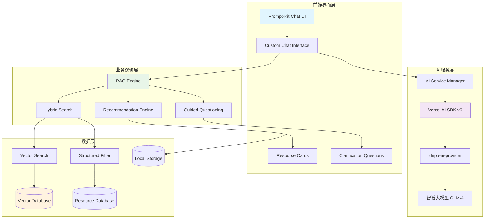

# Design Document: AI聊天助手

## Overview

AI聊天助手是设计百宝箱平台的智能对话功能，通过RAG（检索增强生成）技术和混合搜索，为用户提供个性化的设计资源推荐。该系统结合了语义向量搜索和结构化过滤，能够理解用户的自然语言查询并提供精准的资源匹配。

### 核心特性
- **RAG检索增强生成**: 结合向量搜索和传统搜索提供精准匹配
- **混合搜索**: 语义搜索 + 结构化过滤（评分、类别等）
- **引导式对话**: 智能澄清模糊需求
- **视觉预览**: 对话中直接展示资源缩略图
- **响应式界面**: 适配桌面、平板、移动设备

## Architecture

### 系统架构图



### 技术栈选择

**前端框架**:
- Next.js 16 (App Router) - 服务端渲染和客户端交互
- React 19 - UI组件库
- TypeScript 5 - 类型安全

**AI与搜索**:
- Vercel AI SDK v6 - LLM集成和流式响应
- prompt-kit - AI聊天界面组件库
- zhipu-ai-provider - 智谱大模型集成 (兼容Vercel AI SDK)
- 智谱大模型 (GLM) - 自然语言理解和生成
- 智谱Embeddings - 向量化 (或OpenAI Embeddings作为备选)
- 本地向量存储 - 基于现有资源数据

**UI组件**:
- shadcn/ui - 基础组件库
- Tailwind CSS 4 - 样式系统
- motion/react - 动画效果
- Lucide React - 图标库

**状态管理**:
- React Context - 聊天状态管理
- localStorage - 会话持久化
- TanStack Query - 服务端状态缓存

### AI模型接口设计

为了支持未来的模型扩展，设计了一个灵活的AI提供者接口：

```typescript
// AI提供者抽象接口
interface AIProvider {
  name: string;
  version: string;
  capabilities: AICapabilities;
  
  // 聊天完成
  generateChatCompletion(messages: ChatMessage[], options?: ChatOptions): Promise<ChatResponse>;
  
  // 流式聊天
  streamChatCompletion(messages: ChatMessage[], options?: ChatOptions): AsyncIterable<ChatChunk>;
  
  // 文本嵌入
  generateEmbedding(text: string): Promise<number[]>;
  
  // 批量嵌入
  generateEmbeddings(texts: string[]): Promise<number[][]>;
}

// AI能力定义
interface AICapabilities {
  chat: boolean;
  streaming: boolean;
  embedding: boolean;
  functionCalling: boolean;
  maxTokens: number;
  supportedLanguages: string[];
}

// 智谱AI提供者实现
class ZhipuAIProvider implements AIProvider {
  name = 'zhipu-ai';
  version = '0.2.1';
  capabilities: AICapabilities = {
    chat: true,
    streaming: true,
    embedding: true,
    functionCalling: true,
    maxTokens: 8192,
    supportedLanguages: ['zh', 'en']
  };

  constructor(private apiKey: string, private baseURL?: string) {}

  async generateChatCompletion(messages: ChatMessage[], options?: ChatOptions): Promise<ChatResponse> {
    // 使用zhipu-ai-provider实现
  }

  streamChatCompletion(messages: ChatMessage[], options?: ChatOptions): AsyncIterable<ChatChunk> {
    // 流式响应实现
  }

  async generateEmbedding(text: string): Promise<number[]> {
    // 嵌入生成实现
  }

  async generateEmbeddings(texts: string[]): Promise<number[][]> {
    // 批量嵌入实现
  }
}

// AI提供者工厂
class AIProviderFactory {
  private providers = new Map<string, AIProvider>();

  register(provider: AIProvider): void {
    this.providers.set(provider.name, provider);
  }

  get(name: string): AIProvider | undefined {
    return this.providers.get(name);
  }

  getDefault(): AIProvider {
    return this.providers.get('zhipu-ai') || this.providers.values().next().value;
  }
}
```

### Prompt-Kit集成架构

```typescript
// 基于prompt-kit的聊天界面配置
interface ChatInterfaceConfig {
  provider: AIProvider;
  systemPrompt: string;
  maxMessages: number;
  enableStreaming: boolean;
  enableFunctionCalling: boolean;
  customComponents?: {
    MessageRenderer?: React.ComponentType<MessageProps>;
    ResourceCard?: React.ComponentType<ResourceCardProps>;
    LoadingIndicator?: React.ComponentType;
  };
}

// 扩展prompt-kit的消息类型
interface ExtendedChatMessage extends ChatMessage {
  resources?: ResourceRecommendation[];
  clarificationQuestions?: string[];
  searchMetadata?: {
    query: string;
    filters: SearchFilters;
    resultCount: number;
  };
}
```

### 配置管理与扩展性

#### AI提供者配置

```typescript
// 环境变量配置
interface AIEnvironmentConfig {
  // 智谱AI配置
  ZHIPU_AI_API_KEY: string;
  ZHIPU_AI_BASE_URL?: string;
  ZHIPU_AI_MODEL?: 'glm-4' | 'glm-4-turbo' | 'glm-3-turbo';
  
  // 备用提供者配置（预留）
  OPENAI_API_KEY?: string;
  ANTHROPIC_API_KEY?: string;
  
  // 功能开关
  ENABLE_STREAMING?: boolean;
  ENABLE_FUNCTION_CALLING?: boolean;
  MAX_CONVERSATION_LENGTH?: number;
}

// 运行时配置
interface AIRuntimeConfig {
  defaultProvider: string;
  fallbackProviders: string[];
  maxRetries: number;
  timeoutMs: number;
  enableCaching: boolean;
  cacheExpiryMs: number;
}

// 配置管理器
class AIConfigManager {
  private config: AIRuntimeConfig;
  private envConfig: AIEnvironmentConfig;

  constructor() {
    this.loadConfiguration();
  }

  private loadConfiguration(): void {
    this.envConfig = {
      ZHIPU_AI_API_KEY: process.env.ZHIPU_AI_API_KEY!,
      ZHIPU_AI_BASE_URL: process.env.ZHIPU_AI_BASE_URL,
      ZHIPU_AI_MODEL: (process.env.ZHIPU_AI_MODEL as any) || 'glm-4',
      ENABLE_STREAMING: process.env.ENABLE_STREAMING === 'true',
      ENABLE_FUNCTION_CALLING: process.env.ENABLE_FUNCTION_CALLING === 'true',
      MAX_CONVERSATION_LENGTH: parseInt(process.env.MAX_CONVERSATION_LENGTH || '50'),
    };

    this.config = {
      defaultProvider: 'zhipu-ai',
      fallbackProviders: [],
      maxRetries: 3,
      timeoutMs: 30000,
      enableCaching: true,
      cacheExpiryMs: 300000, // 5分钟
    };
  }

  getProviderConfig(providerName: string): VercelAIConfig {
    switch (providerName) {
      case 'zhipu-ai':
        return {
          provider: 'zhipu-ai',
          model: this.envConfig.ZHIPU_AI_MODEL!,
          apiKey: this.envConfig.ZHIPU_AI_API_KEY,
          baseURL: this.envConfig.ZHIPU_AI_BASE_URL,
          streamingEnabled: this.envConfig.ENABLE_STREAMING || true,
        };
      default:
        throw new Error(`Unknown provider: ${providerName}`);
    }
  }
}
```

#### 扩展新AI提供者的步骤

1. **实现AIProvider接口**：
```typescript
class NewAIProvider implements AIProvider {
  name = 'new-provider';
  version = '1.0.0';
  capabilities = { /* ... */ };
  
  // 实现所有必需方法
}
```

2. **注册到工厂**：
```typescript
const factory = new AIProviderFactory();
factory.register(new NewAIProvider(config));
```

3. **更新配置管理器**：
```typescript
// 在AIConfigManager中添加新的配置分支
case 'new-provider':
  return {
    provider: 'new-provider',
    // 新提供者的配置
  };
```

4. **环境变量配置**：
```bash
# .env.local
NEW_PROVIDER_API_KEY=your_api_key
NEW_PROVIDER_MODEL=model_name
```

这种设计确保了系统的可扩展性，可以轻松添加新的AI提供者而不影响现有功能。

## Components and Interfaces

### 核心组件架构

#### 1. Chat Interface (基于prompt-kit)
```typescript
// 基于prompt-kit的聊天界面组件
interface ChatInterfaceProps {
  isOpen: boolean;
  onClose: () => void;
  initialQuery?: string;
  provider: AIProvider;
  config: ChatInterfaceConfig;
}

// 扩展的聊天消息类型
interface ExtendedChatMessage extends ChatMessage {
  id: string;
  type: 'user' | 'assistant' | 'system';
  content: string;
  timestamp: Date;
  resources?: ResourceRecommendation[];
  clarificationQuestions?: string[];
  searchMetadata?: SearchMetadata;
  isLoading?: boolean;
}

// 搜索元数据
interface SearchMetadata {
  query: string;
  filters: SearchFilters;
  resultCount: number;
  processingTime: number;
  searchType: 'semantic' | 'hybrid' | 'fallback';
}
```

#### 2. AI Provider Integration (Vercel AI SDK v6)
```typescript
// Vercel AI SDK集成配置
interface VercelAIConfig {
  provider: 'zhipu-ai' | 'openai' | 'anthropic';
  model: string;
  apiKey: string;
  baseURL?: string;
  maxTokens?: number;
  temperature?: number;
  streamingEnabled: boolean;
}

// 智谱AI提供者配置
interface ZhipuAIConfig extends VercelAIConfig {
  provider: 'zhipu-ai';
  model: 'glm-4' | 'glm-4-turbo' | 'glm-3-turbo';
  embeddingModel?: 'embedding-2' | 'embedding-3';
}

// AI服务管理器
class AIServiceManager {
  private currentProvider: AIProvider;
  private fallbackProviders: AIProvider[];

  constructor(config: VercelAIConfig) {
    this.currentProvider = this.createProvider(config);
  }

  async switchProvider(config: VercelAIConfig): Promise<void> {
    this.currentProvider = this.createProvider(config);
  }

  private createProvider(config: VercelAIConfig): AIProvider {
    switch (config.provider) {
      case 'zhipu-ai':
        return new ZhipuAIProvider(config as ZhipuAIConfig);
      default:
        throw new Error(`Unsupported provider: ${config.provider}`);
    }
  }
}
```

#### 3. Prompt-Kit集成与自定义

```typescript
// prompt-kit自定义配置
interface PromptKitCustomization {
  // 自定义消息渲染器
  messageRenderer: {
    UserMessage: React.ComponentType<UserMessageProps>;
    AssistantMessage: React.ComponentType<AssistantMessageProps>;
    ResourceMessage: React.ComponentType<ResourceMessageProps>;
    ClarificationMessage: React.ComponentType<ClarificationMessageProps>;
  };

  // 自定义输入组件
  inputComponents: {
    TextInput: React.ComponentType<TextInputProps>;
    SendButton: React.ComponentType<SendButtonProps>;
    AttachmentButton?: React.ComponentType<AttachmentButtonProps>;
  };

  // 自定义主题
  theme: {
    colors: {
      primary: string;
      secondary: string;
      background: string;
      surface: string;
      text: string;
      textSecondary: string;
    };
    spacing: {
      xs: string;
      sm: string;
      md: string;
      lg: string;
      xl: string;
    };
    borderRadius: string;
    shadows: {
      sm: string;
      md: string;
      lg: string;
    };
  };
}

// 资源消息组件
interface ResourceMessageProps {
  resources: ResourceRecommendation[];
  onResourceClick: (resource: Resource) => void;
  onFavorite: (resourceId: string) => void;
  onVisit: (resourceId: string) => void;
}

// 澄清问题组件
interface ClarificationMessageProps {
  questions: string[];
  onQuestionSelect: (question: string) => void;
  onCustomResponse: (response: string) => void;
}
```

#### 4. RAG Engine (检索增强生成引擎)
```typescript
interface RAGEngine {
  search(query: string, filters?: SearchFilters): Promise<SearchResult[]>;
  generateResponse(query: string, context: SearchResult[], provider: AIProvider): Promise<string>;
  embedQuery(query: string, provider: AIProvider): Promise<number[]>;
  
  // 新增：支持流式响应
  streamResponse(query: string, context: SearchResult[], provider: AIProvider): AsyncIterable<string>;
}

// 集成Vercel AI SDK的RAG实现
class VercelAIRAGEngine implements RAGEngine {
  constructor(
    private hybridSearch: HybridSearchEngine,
    private guidedQuestioning: GuidedQuestioningEngine
  ) {}

  async generateResponse(query: string, context: SearchResult[], provider: AIProvider): Promise<string> {
    // 使用Vercel AI SDK生成响应
    const { text } = await generateText({
      model: provider.getModel(),
      messages: this.buildMessages(query, context),
      maxTokens: 1000,
      temperature: 0.7,
    });
    
    return text;
  }

  async *streamResponse(query: string, context: SearchResult[], provider: AIProvider): AsyncIterable<string> {
    // 使用Vercel AI SDK流式生成
    const { textStream } = await streamText({
      model: provider.getModel(),
      messages: this.buildMessages(query, context),
      maxTokens: 1000,
      temperature: 0.7,
    });

    for await (const chunk of textStream) {
      yield chunk;
    }
  }

  private buildMessages(query: string, context: SearchResult[]): any[] {
    const systemPrompt = this.buildSystemPrompt(context);
    return [
      { role: 'system', content: systemPrompt },
      { role: 'user', content: query }
    ];
  }

  private buildSystemPrompt(context: SearchResult[]): string {
    const resourceContext = context.map(result => 
      `资源: ${result.resource.name}\n类别: ${result.resource.category}\n评分: ${result.resource.rating}\n描述: ${result.resource.description}\n匹配理由: ${result.matchReason}`
    ).join('\n\n');

    return `你是设计百宝箱的AI助手，专门帮助用户找到最适合的设计资源。

基于以下资源信息回答用户问题：
${resourceContext}

请遵循以下原则：
1. 提供具体的资源推荐，解释为什么推荐
2. 如果用户需求不明确，主动询问澄清问题
3. 保持友好、专业的语调
4. 重点关注资源的实用性和匹配度
5. 如果没有完全匹配的资源，推荐相近的替代方案`;
  }
}
```
```typescript
interface RAGEngine {
  search(query: string, filters?: SearchFilters): Promise<SearchResult[]>;
  generateResponse(query: string, context: SearchResult[]): Promise<string>;
  embedQuery(query: string): Promise<number[]>;
}

interface SearchFilters {
  categories?: string[];
  minRating?: number;
  maxResults?: number;
  excludeIds?: string[];
}

interface SearchResult {
  resource: Resource;
  similarity: number;
  matchReason: string;
}
```

#### 3. Hybrid Search System (混合搜索系统)
```typescript
interface HybridSearchEngine {
  vectorSearch(embedding: number[], limit: number): Promise<VectorMatch[]>;
  structuredFilter(resources: Resource[], filters: SearchFilters): Resource[];
  combineResults(vectorResults: VectorMatch[], filteredResults: Resource[]): SearchResult[];
}

interface VectorMatch {
  resourceId: string;
  similarity: number;
  resource: Resource;
}
```

#### 4. Guided Questioning (引导式提问)
```typescript
interface GuidedQuestioningEngine {
  analyzeQueryClarity(query: string): QueryAnalysis;
  generateClarificationQuestions(analysis: QueryAnalysis): string[];
  shouldAskForClarification(analysis: QueryAnalysis): boolean;
}

interface QueryAnalysis {
  clarity: 'clear' | 'vague' | 'ambiguous';
  missingAspects: ('category' | 'style' | 'audience' | 'purpose')[];
  confidence: number;
}
```

#### 5. Visual Preview Component (视觉预览组件)
```typescript
interface ResourcePreviewCard {
  resource: Resource;
  matchReason: string;
  onFavorite: (resourceId: string) => void;
  onVisit: (resourceId: string) => void;
  onViewDetails: (resourceId: string) => void;
}

interface PreviewImage {
  src: string;
  alt: string;
  fallback: string;
  loading: 'lazy' | 'eager';
}
```

### 响应式布局设计

#### 桌面设备 (≥1200px)
- 右侧固定宽度面板 (400px)
- 主内容区域自适应调整
- 聊天界面滑入动画

#### 平板设备 (768px - 1199px)
- 右侧面板宽度调整为 350px
- 保持侧边栏布局

#### 移动设备 (<768px)
- 全屏覆盖模式
- 顶部返回按钮
- 底部输入框固定

## Data Models

### 聊天会话数据模型

```typescript
// 扩展现有的Resource类型
interface EnhancedResource extends Resource {
  embedding?: number[];
  searchKeywords: string[];
  semanticTags: string[];
}

// 聊天消息模型
interface ChatMessage {
  id: string;
  sessionId: string;
  type: 'user' | 'assistant' | 'system';
  content: string;
  timestamp: Date;
  metadata?: {
    query?: string;
    searchResults?: SearchResult[];
    clarificationNeeded?: boolean;
    resources?: ResourceRecommendation[];
  };
}

// 聊天会话模型
interface ChatSession {
  id: string;
  userId?: string;
  messages: ChatMessage[];
  createdAt: Date;
  updatedAt: Date;
  context: {
    lastQuery?: string;
    userPreferences?: UserPreferences;
    conversationSummary?: string;
  };
}

// 资源推荐模型
interface ResourceRecommendation {
  resource: EnhancedResource;
  relevanceScore: number;
  matchReason: string;
  matchedAspects: string[];
  confidence: number;
}

// 用户偏好模型
interface UserPreferences {
  favoriteCategories: string[];
  stylePreferences: string[];
  audienceType: 'young' | 'professional' | 'mixed';
  qualityThreshold: number;
}
```

### 向量搜索数据结构

```typescript
// 向量索引结构
interface VectorIndex {
  resourceId: string;
  embedding: number[];
  metadata: {
    category: string;
    rating: number;
    tags: string[];
    lastUpdated: Date;
  };
}

// 搜索查询结构
interface SearchQuery {
  text: string;
  embedding: number[];
  filters: SearchFilters;
  context?: {
    previousQueries: string[];
    userPreferences?: UserPreferences;
  };
}
```

## Correctness Properties

*A property is a characteristic or behavior that should hold true across all valid executions of a system-essentially, a formal statement about what the system should do. Properties serve as the bridge between human-readable specifications and machine-verifiable correctness guarantees.*

### Property-Based Testing Overview

Property-based testing (PBT) validates software correctness by testing universal properties across many generated inputs. Each property is a formal specification that should hold for all valid inputs.

### Prework Analysis

Let me analyze the acceptance criteria for testability:

<function_calls>
<invoke name="prework">
<parameter name="featureName">ai-chat-assistant

### Property Reflection

After analyzing all acceptance criteria, I identified several areas where properties can be consolidated to eliminate redundancy:

**UI Interaction Properties**: Properties 1.1-1.5 all relate to chat interface behavior and can be streamlined to focus on core functionality.

**Search and Recommendation Properties**: Properties 2.1-2.5 and 5.1-5.5 overlap in testing search functionality and can be combined into comprehensive search properties.

**Session Management Properties**: Properties 7.1-7.5 all test different aspects of session persistence and can be consolidated.

**Responsive Design Properties**: Properties 8.1-8.5 test similar responsive behaviors across different screen sizes.

### Core Correctness Properties

Based on the prework analysis, here are the essential correctness properties:

**Property 1: Chat Interface Trigger and Display**
*For any* user input in the bottom AI input box, triggering the send action should cause the chat interface to slide in from the right and display the user's query as the first message
**Validates: Requirements 1.1, 1.2**

**Property 2: Session State Persistence**
*For any* chat session, closing and reopening the interface should preserve the complete conversation history and restore the session state
**Validates: Requirements 1.4, 1.5, 7.1, 7.2, 7.3, 7.4**

**Property 3: Hybrid Search Integration**
*For any* user query containing both semantic content and structured filters (rating, category), the RAG engine should return results that satisfy both the semantic similarity and the structured constraints
**Validates: Requirements 2.1, 2.2, 2.3, 2.4**

**Property 4: Guided Questioning for Vague Queries**
*For any* ambiguous or vague user query, the system should detect the ambiguity and provide specific clarification questions related to the missing information
**Validates: Requirements 3.1, 3.2, 3.3, 3.4**

**Property 5: Visual Preview Completeness**
*For any* resource recommendation, the visual preview card should contain all required elements (screenshot, name, category, rating, description) and handle loading/error states appropriately
**Validates: Requirements 4.1, 4.2, 4.3, 4.4**

**Property 6: Recommendation Quality and Explanation**
*For any* search query, the recommendation engine should return at most 5 resources with specific match reasons that relate to the user's query
**Validates: Requirements 5.1, 5.2, 5.3, 5.4**

**Property 7: Resource Interaction Functionality**
*For any* resource card in the chat interface, clicking different action buttons (view details, favorite, visit) should trigger the appropriate navigation or state changes
**Validates: Requirements 6.1, 6.2, 6.3**

**Property 8: Responsive Layout Adaptation**
*For any* screen size change, the chat interface should adapt its layout appropriately (right panel for desktop, adjusted width for tablet, fullscreen for mobile)
**Validates: Requirements 8.1, 8.2, 8.3, 8.4**

**Property 9: Performance and Error Resilience**
*For any* user query, the system should respond within 3 seconds or provide appropriate error handling with fallback suggestions
**Validates: Requirements 9.1, 9.2, 9.4**

## Error Handling

### 错误处理策略

#### 1. AI服务错误处理
- **服务不可用**: 显示友好错误提示，提供基础搜索功能
- **响应超时**: 3秒超时机制，显示加载状态后提供备用建议
- **API限制**: 实现请求队列和重试机制

#### 2. 网络连接错误
- **离线检测**: 监听网络状态变化
- **请求缓存**: 保存失败的请求，连接恢复后重试
- **优雅降级**: 提供基于本地数据的基础搜索

#### 3. 数据加载错误
- **资源图片加载失败**: 显示默认占位图
- **向量搜索失败**: 回退到传统关键词搜索
- **会话数据损坏**: 重置会话并通知用户

#### 4. 用户输入错误
- **空查询**: 提供搜索建议和热门资源
- **无效字符**: 清理输入并提示用户
- **过长查询**: 截断并提示字数限制

### 错误恢复机制

```typescript
interface ErrorRecoveryStrategy {
  type: 'retry' | 'fallback' | 'graceful_degradation';
  maxRetries: number;
  backoffStrategy: 'linear' | 'exponential';
  fallbackAction: () => Promise<void>;
}

interface ErrorHandler {
  handleAIServiceError(error: AIServiceError): Promise<ChatMessage>;
  handleNetworkError(error: NetworkError): Promise<void>;
  handleDataLoadError(error: DataError): Promise<void>;
  handleUserInputError(error: InputError): string;
}
```

## Testing Strategy

### 双重测试方法

本项目采用单元测试和基于属性的测试相结合的方法：

**单元测试**:
- 验证特定示例和边界情况
- 测试组件集成点
- 验证错误处理逻辑
- 测试用户交互流程

**基于属性的测试**:
- 验证跨所有输入的通用属性
- 通过随机化实现全面的输入覆盖
- 测试系统在各种条件下的正确性
- 验证设计文档中定义的正确性属性

### 测试框架配置

**属性测试库**: fast-check
- 每个属性测试最少运行100次迭代
- 每个测试必须引用其设计文档属性
- 标签格式: **Feature: ai-chat-assistant, Property {number}: {property_text}**

**单元测试库**: Vitest + @testing-library/react
- 组件渲染和交互测试
- 钩子函数行为验证
- API集成测试

### 测试覆盖范围

#### 核心功能测试
1. **聊天界面交互**: 打开/关闭、消息显示、响应式布局
2. **RAG搜索引擎**: 向量搜索、混合搜索、结果排序
3. **引导式提问**: 模糊查询检测、澄清问题生成
4. **视觉预览**: 资源卡片渲染、图片加载、错误处理
5. **会话管理**: 状态持久化、历史恢复、存储限制

#### 集成测试
1. **端到端用户流程**: 从查询输入到资源推荐的完整流程
2. **跨组件通信**: 组件间状态同步和数据传递
3. **外部服务集成**: AI API调用、错误处理、重试机制

#### 性能测试
1. **响应时间**: 查询处理时间、界面渲染性能
2. **内存使用**: 会话数据管理、组件卸载清理
3. **并发处理**: 多个查询同时处理的稳定性

### 测试数据生成

```typescript
// 属性测试数据生成器
const queryGenerator = fc.string({ minLength: 1, maxLength: 200 });
const resourceGenerator = fc.record({
  id: fc.string(),
  name: fc.string(),
  category: fc.constantFrom('colors', 'fonts', 'icons', 'templates'),
  rating: fc.float({ min: 1, max: 5 }),
  description: fc.string({ maxLength: 500 })
});

// 测试场景生成
const searchScenarioGenerator = fc.record({
  query: queryGenerator,
  filters: fc.record({
    categories: fc.array(fc.string()),
    minRating: fc.option(fc.float({ min: 1, max: 5 })),
    maxResults: fc.option(fc.integer({ min: 1, max: 10 }))
  }),
  expectedBehavior: fc.constantFrom('success', 'clarification_needed', 'no_results')
});
```

这个设计文档为AI聊天助手功能提供了完整的技术架构和实现指导，结合了现代Web开发最佳实践和AI技术，确保功能的可靠性和用户体验。