# Design Document: AI聊天助手

## Overview

AI聊天助手是设计百宝箱平台的智能对话功能，通过RAG（检索增强生成）技术和混合搜索，为用户提供个性化的设计资源推荐。该系统结合了语义向量搜索和结构化过滤，能够理解用户的自然语言查询并提供精准的资源匹配。

### 核心特性
- **RAG检索增强生成**: 结合向量搜索和传统搜索提供精准匹配
- **混合搜索**: 语义搜索 + 结构化过滤（评分、类别等）
- **引导式对话**: 智能澄清模糊需求
- **视觉预览**: 对话中直接展示资源缩略图
- **响应式界面**: 适配桌面、平板、移动设备

## Architecture

### 系统架构图

```mermaid
graph TB
    subgraph "前端界面层"
        PK[Prompt-Kit Chat UI]
        CI[Custom Chat Interface]
        RC[Resource Cards]
        CQ[Clarification Questions]
    end
    
    subgraph "AI服务层"
        VSDK[Vercel AI SDK v6]
        ZAP[zhipu-ai-provider]
        AIM[AI Service Manager]
        GLM[智谱大模型 GLM-4]
    end
    
    subgraph "业务逻辑层"
        RAG[RAG Engine]
        HS[Hybrid Search]
        GQ[Guided Questioning]
        RE[Recommendation Engine]
    end
    
    subgraph "数据层"
        VS[Vector Search]
        SF[Structured Filter]
        VDB[(Vector Database)]
        RDB[(Resource Database)]
        LS[(Local Storage)]
    end
    
    PK --> CI
    CI --> AIM
    AIM --> VSDK
    VSDK --> ZAP
    ZAP --> GLM
    
    CI --> RAG
    RAG --> HS
    RAG --> GQ
    HS --> VS
    HS --> SF
    VS --> VDB
    SF --> RDB
    
    RAG --> RE
    RE --> RC
    GQ --> CQ
    
    CI --> LS
    
    style PK fill:#e1f5fe
    style VSDK fill:#f3e5f5
    style RAG fill:#e8f5e8
    style VDB fill:#fff3e0
```



### 技术栈选择

**前端框架**:
- Next.js 16 (App Router) - 服务端渲染和客户端交互
- React 19 - UI组件库
- TypeScript 5 - 类型安全

**AI与搜索**:
- Vercel AI SDK v6 - LLM集成和流式响应
- prompt-kit - AI聊天界面组件库
- zhipu-ai-provider - 智谱大模型集成 (兼容Vercel AI SDK)
- 智谱大模型 (GLM) - 自然语言理解和生成
- 智谱Embeddings - 向量化 (或OpenAI Embeddings作为备选)
- 本地向量存储 - 基于现有资源数据

**UI组件**:
- shadcn/ui - 基础组件库
- Tailwind CSS 4 - 样式系统
- motion/react - 动画效果
- Lucide React - 图标库

**状态管理**:
- React Context - 聊天状态管理
- localStorage - 会话持久化
- TanStack Query - 服务端状态缓存

### AI模型接口设计

为了支持未来的模型扩展，设计了一个灵活的AI提供者接口：

```typescript
// AI提供者抽象接口
interface AIProvider {
  name: string;
  version: string;
  capabilities: AICapabilities;
  
  // 聊天完成
  generateChatCompletion(messages: ChatMessage[], options?: ChatOptions): Promise<ChatResponse>;
  
  // 流式聊天
  streamChatCompletion(messages: ChatMessage[], options?: ChatOptions): AsyncIterable<ChatChunk>;
  
  // 文本嵌入
  generateEmbedding(text: string): Promise<number[]>;
  
  // 批量嵌入
  generateEmbeddings(texts: string[]): Promise<number[][]>;
}

// AI能力定义
interface AICapabilities {
  chat: boolean;
  streaming: boolean;
  embedding: boolean;
  functionCalling: boolean;
  maxTokens: number;
  supportedLanguages: string[];
}

// 智谱AI提供者实现
class ZhipuAIProvider implements AIProvider {
  name = 'zhipu-ai';
  version = '0.2.1';
  capabilities: AICapabilities = {
    chat: true,
    streaming: true,
    embedding: true,
    functionCalling: true,
    maxTokens: 8192,
    supportedLanguages: ['zh', 'en']
  };

  constructor(private apiKey: string, private baseURL?: string) {}

  async generateChatCompletion(messages: ChatMessage[], options?: ChatOptions): Promise<ChatResponse> {
    // 使用zhipu-ai-provider实现
  }

  streamChatCompletion(messages: ChatMessage[], options?: ChatOptions): AsyncIterable<ChatChunk> {
    // 流式响应实现
  }

  async generateEmbedding(text: string): Promise<number[]> {
    // 嵌入生成实现
  }

  async generateEmbeddings(texts: string[]): Promise<number[][]> {
    // 批量嵌入实现
  }
}

// AI提供者工厂
class AIProviderFactory {
  private providers = new Map<string, AIProvider>();

  register(provider: AIProvider): void {
    this.providers.set(provider.name, provider);
  }

  get(name: string): AIProvider | undefined {
    return this.providers.get(name);
  }

  getDefault(): AIProvider {
    return this.providers.get('zhipu-ai') || this.providers.values().next().value;
  }
}
```

### Prompt-Kit集成架构

```typescript
// 基于prompt-kit的聊天界面配置
interface ChatInterfaceConfig {
  provider: AIProvider;
  systemPrompt: string;
  maxMessages: number;
  enableStreaming: boolean;
  enableFunctionCalling: boolean;
  customComponents?: {
    MessageRenderer?: React.ComponentType<MessageProps>;
    ResourceCard?: React.ComponentType<ResourceCardProps>;
    LoadingIndicator?: React.ComponentType;
  };
}

// 扩展prompt-kit的消息类型
interface ExtendedChatMessage extends ChatMessage {
  resources?: ResourceRecommendation[];
  clarificationQuestions?: string[];
  searchMetadata?: {
    query: string;
    filters: SearchFilters;
    resultCount: number;
  };
}
```

### 配置管理与扩展性

#### AI提供者配置

```typescript
// 环境变量配置
interface AIEnvironmentConfig {
  // 智谱AI配置
  ZHIPU_AI_API_KEY: string;
  ZHIPU_AI_BASE_URL?: string;
  ZHIPU_AI_MODEL?: 'glm-4' | 'glm-4-turbo' | 'glm-3-turbo';
  
  // 备用提供者配置（预留）
  OPENAI_API_KEY?: string;
  ANTHROPIC_API_KEY?: string;
  
  // 功能开关
  ENABLE_STREAMING?: boolean;
  ENABLE_FUNCTION_CALLING?: boolean;
  MAX_CONVERSATION_LENGTH?: number;
}

// 运行时配置
interface AIRuntimeConfig {
  defaultProvider: string;
  fallbackProviders: string[];
  maxRetries: number;
  timeoutMs: number;
  enableCaching: boolean;
  cacheExpiryMs: number;
}

// 配置管理器
class AIConfigManager {
  private config: AIRuntimeConfig;
  private envConfig: AIEnvironmentConfig;

  constructor() {
    this.loadConfiguration();
  }

  private loadConfiguration(): void {
    this.envConfig = {
      ZHIPU_AI_API_KEY: process.env.ZHIPU_AI_API_KEY!,
      ZHIPU_AI_BASE_URL: process.env.ZHIPU_AI_BASE_URL,
      ZHIPU_AI_MODEL: (process.env.ZHIPU_AI_MODEL as any) || 'glm-4',
      ENABLE_STREAMING: process.env.ENABLE_STREAMING === 'true',
      ENABLE_FUNCTION_CALLING: process.env.ENABLE_FUNCTION_CALLING === 'true',
      MAX_CONVERSATION_LENGTH: parseInt(process.env.MAX_CONVERSATION_LENGTH || '50'),
    };

    this.config = {
      defaultProvider: 'zhipu-ai',
      fallbackProviders: [],
      maxRetries: 3,
      timeoutMs: 30000,
      enableCaching: true,
      cacheExpiryMs: 300000, // 5分钟
    };
  }

  getProviderConfig(providerName: string): VercelAIConfig {
    switch (providerName) {
      case 'zhipu-ai':
        return {
          provider: 'zhipu-ai',
          model: this.envConfig.ZHIPU_AI_MODEL!,
          apiKey: this.envConfig.ZHIPU_AI_API_KEY,
          baseURL: this.envConfig.ZHIPU_AI_BASE_URL,
          streamingEnabled: this.envConfig.ENABLE_STREAMING || true,
        };
      default:
        throw new Error(`Unknown provider: ${providerName}`);
    }
  }
}
```

#### 扩展新AI提供者的步骤

1. **实现AIProvider接口**：
```typescript
class NewAIProvider implements AIProvider {
  name = 'new-provider';
  version = '1.0.0';
  capabilities = { /* ... */ };
  
  // 实现所有必需方法
}
```

2. **注册到工厂**：
```typescript
const factory = new AIProviderFactory();
factory.register(new NewAIProvider(config));
```

3. **更新配置管理器**：
```typescript
// 在AIConfigManager中添加新的配置分支
case 'new-provider':
  return {
    provider: 'new-provider',
    // 新提供者的配置
  };
```

4. **环境变量配置**：
```bash
# .env.local
NEW_PROVIDER_API_KEY=your_api_key
NEW_PROVIDER_MODEL=model_name
```

这种设计确保了系统的可扩展性，可以轻松添加新的AI提供者而不影响现有功能。

## Components and Interfaces

### 核心组件架构

#### 1. 底部触发输入框 (AIPromptInput)
```typescript
interface AIPromptInputProps {
  value: string;
  onValueChange: (value: string) => void;
  onSubmit: (value: string) => void;
  placeholder?: string;
  isLoading?: boolean;
  className?: string;
}

// 功能：
// - 固定在页面底部居中
// - 用户输入后触发聊天面板打开
// - 面板打开时自动隐藏
// - 面板关闭时复原
```

#### 2. 聊天界面 (AIChatInterface)
```typescript
interface AIChatInterfaceProps {
  isOpen: boolean;
  onClose: () => void;
  initialQuery?: string;
}

// PC端：右侧固定面板（400px）
// 移动端：全屏模式（fixed覆盖）
// 包含：对话区域 + 面板内输入框
```

#### 3. 快速回复按钮 (QuickReplyButtons)
```typescript
interface QuickReplyButtonsProps {
  replies: string[];
  onSelect: (reply: string) => void;
  className?: string;
}

// 功能：
// - 一次显示所有澄清选项
// - 圆角胶囊样式
// - 支持emoji图标
// - 点击后作为用户消息发送
```

#### 4. 简化资源卡片 (ResourceInlineCard)
```typescript
interface ResourceInlineCardProps {
  resource: Resource;
  onViewDetails?: (resource: Resource) => void;
  variant?: 'default' | 'compact';
}

// 默认显示：
// - 缩略图（16x16 或 48x48）
// - 资源名称
// - 评分星级
// - 类别标签
// 
// 点击/悬停展开：
// - 大图预览
// - 详细描述
// - 完整评分
// - 操作按钮（收藏、访问、详情）
```

#### 5. 资源详情展开 (ResourceDetailSheet)
```typescript
interface ResourceDetailSheetProps {
  resource: Resource;
  isOpen: boolean;
  onOpenChange: (open: boolean) => void;
}

// 使用 @shadcn/sheet 组件
// 移动端：从底部滑出
// 桌面端：从右侧滑出或使用 Popover
```

#### 6. 扩展的聊天消息类型
```typescript
interface ExtendedChatMessage extends ChatMessage {
  id: string;
  type: 'user' | 'assistant' | 'system';
  content: string;
  timestamp: Date;
  resources?: ResourceRecommendation[];
  quickReplies?: string[];  // 快速回复选项
  searchMetadata?: SearchMetadata;
  isLoading?: boolean;
}
```
    switch (config.provider) {
      case 'zhipu-ai':
        return new ZhipuAIProvider(config as ZhipuAIConfig);
      default:
        throw new Error(`Unsupported provider: ${config.provider}`);
    }
  }
}
```

#### 3. Prompt-Kit集成与自定义

```typescript
// prompt-kit自定义配置
interface PromptKitCustomization {
  // 自定义消息渲染器
  messageRenderer: {
    UserMessage: React.ComponentType<UserMessageProps>;
    AssistantMessage: React.ComponentType<AssistantMessageProps>;
    ResourceMessage: React.ComponentType<ResourceMessageProps>;
    ClarificationMessage: React.ComponentType<ClarificationMessageProps>;
  };

  // 自定义输入组件
  inputComponents: {
    TextInput: React.ComponentType<TextInputProps>;
    SendButton: React.ComponentType<SendButtonProps>;
    AttachmentButton?: React.ComponentType<AttachmentButtonProps>;
  };

  // 自定义主题
  theme: {
    colors: {
      primary: string;
      secondary: string;
      background: string;
      surface: string;
      text: string;
      textSecondary: string;
    };
    spacing: {
      xs: string;
      sm: string;
      md: string;
      lg: string;
      xl: string;
    };
    borderRadius: string;
    shadows: {
      sm: string;
      md: string;
      lg: string;
    };
  };
}

// 资源消息组件
interface ResourceMessageProps {
  resources: ResourceRecommendation[];
  onResourceClick: (resource: Resource) => void;
  onFavorite: (resourceId: string) => void;
  onVisit: (resourceId: string) => void;
}

// 澄清问题组件
interface ClarificationMessageProps {
  questions: string[];
  onQuestionSelect: (question: string) => void;
  onCustomResponse: (response: string) => void;
}
```

#### 4. RAG Engine (检索增强生成引擎)
```typescript
interface RAGEngine {
  search(query: string, filters?: SearchFilters): Promise<SearchResult[]>;
  generateResponse(query: string, context: SearchResult[], provider: AIProvider): Promise<string>;
  embedQuery(query: string, provider: AIProvider): Promise<number[]>;
  
  // 新增：支持流式响应
  streamResponse(query: string, context: SearchResult[], provider: AIProvider): AsyncIterable<string>;
}

// 集成Vercel AI SDK的RAG实现
class VercelAIRAGEngine implements RAGEngine {
  constructor(
    private hybridSearch: HybridSearchEngine,
    private guidedQuestioning: GuidedQuestioningEngine
  ) {}

  async generateResponse(query: string, context: SearchResult[], provider: AIProvider): Promise<string> {
    // 使用Vercel AI SDK生成响应
    const { text } = await generateText({
      model: provider.getModel(),
      messages: this.buildMessages(query, context),
      maxTokens: 1000,
      temperature: 0.7,
    });
    
    return text;
  }

  async *streamResponse(query: string, context: SearchResult[], provider: AIProvider): AsyncIterable<string> {
    // 使用Vercel AI SDK流式生成
    const { textStream } = await streamText({
      model: provider.getModel(),
      messages: this.buildMessages(query, context),
      maxTokens: 1000,
      temperature: 0.7,
    });

    for await (const chunk of textStream) {
      yield chunk;
    }
  }

  private buildMessages(query: string, context: SearchResult[]): any[] {
    const systemPrompt = this.buildSystemPrompt(context);
    return [
      { role: 'system', content: systemPrompt },
      { role: 'user', content: query }
    ];
  }

  private buildSystemPrompt(context: SearchResult[]): string {
    const resourceContext = context.map(result => 
      `资源: ${result.resource.name}\n类别: ${result.resource.category}\n评分: ${result.resource.rating}\n描述: ${result.resource.description}\n匹配理由: ${result.matchReason}`
    ).join('\n\n');

    return `你是设计百宝箱的AI助手，专门帮助用户找到最适合的设计资源。

基于以下资源信息回答用户问题：
${resourceContext}

请遵循以下原则：
1. 提供具体的资源推荐，解释为什么推荐
2. 如果用户需求不明确，主动询问澄清问题
3. 保持友好、专业的语调
4. 重点关注资源的实用性和匹配度
5. 如果没有完全匹配的资源，推荐相近的替代方案`;
  }
}
```
```typescript
interface RAGEngine {
  search(query: string, filters?: SearchFilters): Promise<SearchResult[]>;
  generateResponse(query: string, context: SearchResult[]): Promise<string>;
  embedQuery(query: string): Promise<number[]>;
}

interface SearchFilters {
  categories?: string[];
  minRating?: number;
  maxResults?: number;
  excludeIds?: string[];
}

interface SearchResult {
  resource: Resource;
  similarity: number;
  matchReason: string;
}
```

#### 3. Hybrid Search System (混合搜索系统)
```typescript
interface HybridSearchEngine {
  vectorSearch(embedding: number[], limit: number): Promise<VectorMatch[]>;
  structuredFilter(resources: Resource[], filters: SearchFilters): Resource[];
  combineResults(vectorResults: VectorMatch[], filteredResults: Resource[]): SearchResult[];
}

interface VectorMatch {
  resourceId: string;
  similarity: number;
  resource: Resource;
}
```

#### 4. Guided Questioning (引导式提问)
```typescript
interface GuidedQuestioningEngine {
  analyzeQueryClarity(query: string): QueryAnalysis;
  generateClarificationQuestions(analysis: QueryAnalysis): string[];
  shouldAskForClarification(analysis: QueryAnalysis): boolean;
}

interface QueryAnalysis {
  clarity: 'clear' | 'vague' | 'ambiguous';
  missingAspects: ('category' | 'style' | 'audience' | 'purpose')[];
  confidence: number;
}
```

#### 5. Visual Preview Component (视觉预览组件)
```typescript
interface ResourcePreviewCard {
  resource: Resource;
  matchReason: string;
  onFavorite: (resourceId: string) => void;
  onVisit: (resourceId: string) => void;
  onViewDetails: (resourceId: string) => void;
}

interface PreviewImage {
  src: string;
  alt: string;
  fallback: string;
  loading: 'lazy' | 'eager';
}
```

### UI/UX设计方案

#### 设计原则
1. **对话优先**: 保持对话流连贯性，不打断用户思路
2. **渐进式披露**: 默认显示最少必要信息，需要时才展开
3. **即时反馈**: 清晰的加载状态和实时响应
4. **简单直观**: 减少学习成本，符合用户心智模型
5. **双输入框设计**: 底部触发 + 面板内对话，清晰的交互边界

#### 响应式布局设计

##### 桌面设备 (≥768px)
- **布局**: 右侧固定宽度面板 (400px)
- **主内容**: 不被遮挡，正常显示资源网格
- **触发方式**: 底部悬浮输入框（作为开关）
  - 用户输入内容后打开右侧面板
  - 自动隐藏并清空
  - 面板显示用户输入的内容
  - 关闭面板后复原
- **面板内输入框**: 固定在面板底部，用于持续对话
- **动画**: 面板从右侧滑入/滑出，底部输入框淡入/淡出

##### 平板设备 (768px - 1199px)
- 右侧面板宽度调整为 350px
- 其他与桌面端相同

##### 移动设备 (<768px)
- **布局**: 全屏模式（fixed定位覆盖）
- **性能优化**: 主页面保留在DOM中，不卸载/重新挂载
- **返回按钮**: 顶部左侧，明显可见
- **输入框**: 固定在屏幕底部
- **动画**: 从右侧滑入/滑出

#### 交互流程设计

##### PC端完整交互流程
```
1. 初始状态
   - 底部输入框显示（居中悬浮）
   - 右侧面板隐藏
   
2. 用户输入触发
   - 用户在底部输入框输入内容
   - 按回车或点击发送按钮
   
3. 面板打开
   - 右侧面板滑入动画（400px宽）
   - 底部输入框淡出并隐藏
   - 面板显示用户的初始消息
   
4. 对话进行
   - AI回复显示
   - 如需澄清，显示快速回复按钮
   - 用户使用面板内输入框继续对话
   
5. 资源展示
   - 显示简化资源卡片（缩略图+名称+评分）
   - 悬停/点击展开详细信息
   
6. 面板关闭
   - 用户点击关闭按钮
   - 面板滑出动画
   - 底部输入框淡入并复原（空白状态）
```

##### 移动端完整交互流程
```
1. 初始状态
   - 底部输入框显示
   - 主页面正常显示
   
2. 用户输入触发
   - 用户在底部输入框输入内容
   - 按回车或点击发送按钮
   
3. 全屏覆盖
   - 聊天界面以fixed定位覆盖整个屏幕
   - 主页面保留在DOM中（性能优化）
   - 滑入动画
   
4. 对话进行
   - 显示用户消息和AI回复
   - 快速回复按钮
   - 简化资源卡片
   
5. 返回主页
   - 用户点击返回按钮
   - 聊天界面滑出
   - 主页面恢复显示
```

#### 澄清问题交互设计

##### 快速回复按钮设计
- **显示方式**: 一次显示所有澄清选项（不使用步骤式）
- **样式**: 圆角胶囊按钮，支持emoji图标
- **布局**: 横向排列，自动换行
- **交互**: 点击后作为用户消息发送
- **示例**:
  ```
  AI: "为了给您更精准的推荐，请问您主要需要哪方面的资源？"
  
  [🎨 UI设计灵感] [🔤 字体资源] [🎨 配色工具] [📐 布局模板]
  ```

##### 用户选择方式
1. **点击快速回复按钮**: 直接选择预设选项
2. **直接输入**: 在输入框中输入自定义回答
3. **组合使用**: 点击按钮后可继续补充说明

#### 资源展示设计

##### 简化资源卡片（默认状态）
- **布局**: 横向卡片（16:9或4:3比例）
- **内容**:
  - 缩略图（左侧，48x48或64x64）
  - 资源名称（中间，粗体）
  - 评分星级（中间，小尺寸）
  - 类别标签（右侧，Badge）
  - 箭头图标（右侧，提示可展开）
- **交互**: 悬停显示阴影，点击展开详情

##### 资源详情展开（悬停/点击状态）
- **桌面端**: 使用Popover或Sheet从右侧滑出
- **移动端**: 使用Sheet从底部滑出（占屏幕80%高度）
- **内容**:
  - 大图预览（顶部，全宽）
  - 资源名称（大标题）
  - 完整评分（5个维度）
  - 详细描述
  - 操作按钮（收藏、访问、查看详情）

#### 动画效果规范

##### 面板动画
```typescript
// 滑入/滑出
transition: {
  type: 'spring',
  damping: 30,
  stiffness: 300,
  mass: 0.8
}
```

##### 消息动画
```typescript
// 消息进入
initial: { opacity: 0, y: 20 }
animate: { opacity: 1, y: 0 }
transition: { duration: 0.3, ease: 'easeOut' }
```

##### 快速回复按钮动画
```typescript
// 按钮依次出现
transition: { delay: index * 0.05 }
```

##### 底部输入框动画
```typescript
// 淡入/淡出
animate: {
  opacity: isChatOpen ? 0 : 1,
  y: isChatOpen ? 20 : 0
}
transition: { duration: 0.2 }
```

#### 性能优化策略

##### 移动端DOM保留
```typescript
// ✅ 正确：覆盖显示（性能好）
<>
  <ResourceGrid />  {/* 始终保留在DOM中 */}
  
  <AnimatePresence>
    {isChatOpen && (
      <motion.div className="fixed inset-0 z-50">
        <ChatInterface />
      </motion.div>
    )}
  </AnimatePresence>
</>
```

##### 虚拟滚动
- 当对话历史超过50条时，使用@tanstack/react-virtual
- 预估每条消息高度100px
- 保持5条消息的overscan

##### 图片懒加载
- 使用Next.js Image组件的loading="lazy"
- 提供blur占位符
- 错误处理显示默认占位图

##### 请求优化
- 使用TanStack Query缓存AI响应
- 实现请求去重（相同查询不重复请求）
- 流式响应减少首字节时间

## Data Models

### 聊天会话数据模型

```typescript
// 扩展现有的Resource类型
interface EnhancedResource extends Resource {
  embedding?: number[];
  searchKeywords: string[];
  semanticTags: string[];
}

// 聊天消息模型
interface ChatMessage {
  id: string;
  sessionId: string;
  type: 'user' | 'assistant' | 'system';
  content: string;
  timestamp: Date;
  metadata?: {
    query?: string;
    searchResults?: SearchResult[];
    clarificationNeeded?: boolean;
    resources?: ResourceRecommendation[];
  };
}

// 聊天会话模型
interface ChatSession {
  id: string;
  userId?: string;
  messages: ChatMessage[];
  createdAt: Date;
  updatedAt: Date;
  context: {
    lastQuery?: string;
    userPreferences?: UserPreferences;
    conversationSummary?: string;
  };
}

// 资源推荐模型
interface ResourceRecommendation {
  resource: EnhancedResource;
  relevanceScore: number;
  matchReason: string;
  matchedAspects: string[];
  confidence: number;
}

// 用户偏好模型
interface UserPreferences {
  favoriteCategories: string[];
  stylePreferences: string[];
  audienceType: 'young' | 'professional' | 'mixed';
  qualityThreshold: number;
}
```

### 向量搜索数据结构

```typescript
// 向量索引结构
interface VectorIndex {
  resourceId: string;
  embedding: number[];
  metadata: {
    category: string;
    rating: number;
    tags: string[];
    lastUpdated: Date;
  };
}

// 搜索查询结构
interface SearchQuery {
  text: string;
  embedding: number[];
  filters: SearchFilters;
  context?: {
    previousQueries: string[];
    userPreferences?: UserPreferences;
  };
}
```

## Correctness Properties

*A property is a characteristic or behavior that should hold true across all valid executions of a system-essentially, a formal statement about what the system should do. Properties serve as the bridge between human-readable specifications and machine-verifiable correctness guarantees.*

### Property-Based Testing Overview

Property-based testing (PBT) validates software correctness by testing universal properties across many generated inputs. Each property is a formal specification that should hold for all valid inputs.

### Prework Analysis

Let me analyze the acceptance criteria for testability:

<function_calls>
<invoke name="prework">
<parameter name="featureName">ai-chat-assistant

### Property Reflection

After analyzing all acceptance criteria, I identified several areas where properties can be consolidated to eliminate redundancy:

**UI Interaction Properties**: Properties 1.1-1.5 all relate to chat interface behavior and can be streamlined to focus on core functionality.

**Search and Recommendation Properties**: Properties 2.1-2.5 and 5.1-5.5 overlap in testing search functionality and can be combined into comprehensive search properties.

**Session Management Properties**: Properties 7.1-7.5 all test different aspects of session persistence and can be consolidated.

**Responsive Design Properties**: Properties 8.1-8.5 test similar responsive behaviors across different screen sizes.

### Core Correctness Properties

Based on the prework analysis, here are the essential correctness properties:

**Property 1: Chat Interface Trigger and Display**
*For any* user input in the bottom AI input box, triggering the send action should cause the chat interface to slide in from the right and display the user's query as the first message
**Validates: Requirements 1.1, 1.2**

**Property 2: Session State Persistence**
*For any* chat session, closing and reopening the interface should preserve the complete conversation history and restore the session state
**Validates: Requirements 1.4, 1.5, 7.1, 7.2, 7.3, 7.4**

**Property 3: Hybrid Search Integration**
*For any* user query containing both semantic content and structured filters (rating, category), the RAG engine should return results that satisfy both the semantic similarity and the structured constraints
**Validates: Requirements 2.1, 2.2, 2.3, 2.4**

**Property 4: Guided Questioning for Vague Queries**
*For any* ambiguous or vague user query, the system should detect the ambiguity and provide specific clarification questions related to the missing information
**Validates: Requirements 3.1, 3.2, 3.3, 3.4**

**Property 5: Visual Preview Completeness**
*For any* resource recommendation, the visual preview card should contain all required elements (screenshot, name, category, rating, description) and handle loading/error states appropriately
**Validates: Requirements 4.1, 4.2, 4.3, 4.4**

**Property 6: Recommendation Quality and Explanation**
*For any* search query, the recommendation engine should return at most 5 resources with specific match reasons that relate to the user's query
**Validates: Requirements 5.1, 5.2, 5.3, 5.4**

**Property 7: Resource Interaction Functionality**
*For any* resource card in the chat interface, clicking different action buttons (view details, favorite, visit) should trigger the appropriate navigation or state changes
**Validates: Requirements 6.1, 6.2, 6.3**

**Property 8: Responsive Layout Adaptation**
*For any* screen size change, the chat interface should adapt its layout appropriately (right panel for desktop, adjusted width for tablet, fullscreen for mobile)
**Validates: Requirements 8.1, 8.2, 8.3, 8.4**

**Property 9: Performance and Error Resilience**
*For any* user query, the system should respond within 3 seconds or provide appropriate error handling with fallback suggestions
**Validates: Requirements 9.1, 9.2, 9.4**

## Error Handling

### 错误处理策略

#### 1. AI服务错误处理
- **服务不可用**: 显示友好错误提示，提供基础搜索功能
- **响应超时**: 3秒超时机制，显示加载状态后提供备用建议
- **API限制**: 实现请求队列和重试机制

#### 2. 网络连接错误
- **离线检测**: 监听网络状态变化
- **请求缓存**: 保存失败的请求，连接恢复后重试
- **优雅降级**: 提供基于本地数据的基础搜索

#### 3. 数据加载错误
- **资源图片加载失败**: 显示默认占位图
- **向量搜索失败**: 回退到传统关键词搜索
- **会话数据损坏**: 重置会话并通知用户

#### 4. 用户输入错误
- **空查询**: 提供搜索建议和热门资源
- **无效字符**: 清理输入并提示用户
- **过长查询**: 截断并提示字数限制

### 错误恢复机制

```typescript
interface ErrorRecoveryStrategy {
  type: 'retry' | 'fallback' | 'graceful_degradation';
  maxRetries: number;
  backoffStrategy: 'linear' | 'exponential';
  fallbackAction: () => Promise<void>;
}

interface ErrorHandler {
  handleAIServiceError(error: AIServiceError): Promise<ChatMessage>;
  handleNetworkError(error: NetworkError): Promise<void>;
  handleDataLoadError(error: DataError): Promise<void>;
  handleUserInputError(error: InputError): string;
}
```

## Testing Strategy

### 双重测试方法

本项目采用单元测试和基于属性的测试相结合的方法：

**单元测试**:
- 验证特定示例和边界情况
- 测试组件集成点
- 验证错误处理逻辑
- 测试用户交互流程

**基于属性的测试**:
- 验证跨所有输入的通用属性
- 通过随机化实现全面的输入覆盖
- 测试系统在各种条件下的正确性
- 验证设计文档中定义的正确性属性

### 测试框架配置

**属性测试库**: fast-check
- 每个属性测试最少运行100次迭代
- 每个测试必须引用其设计文档属性
- 标签格式: **Feature: ai-chat-assistant, Property {number}: {property_text}**

**单元测试库**: Vitest + @testing-library/react
- 组件渲染和交互测试
- 钩子函数行为验证
- API集成测试

### 测试覆盖范围

#### 核心功能测试
1. **聊天界面交互**: 打开/关闭、消息显示、响应式布局
2. **RAG搜索引擎**: 向量搜索、混合搜索、结果排序
3. **引导式提问**: 模糊查询检测、澄清问题生成
4. **视觉预览**: 资源卡片渲染、图片加载、错误处理
5. **会话管理**: 状态持久化、历史恢复、存储限制

#### 集成测试
1. **端到端用户流程**: 从查询输入到资源推荐的完整流程
2. **跨组件通信**: 组件间状态同步和数据传递
3. **外部服务集成**: AI API调用、错误处理、重试机制

#### 性能测试
1. **响应时间**: 查询处理时间、界面渲染性能
2. **内存使用**: 会话数据管理、组件卸载清理
3. **并发处理**: 多个查询同时处理的稳定性

### 测试数据生成

```typescript
// 属性测试数据生成器
const queryGenerator = fc.string({ minLength: 1, maxLength: 200 });
const resourceGenerator = fc.record({
  id: fc.string(),
  name: fc.string(),
  category: fc.constantFrom('colors', 'fonts', 'icons', 'templates'),
  rating: fc.float({ min: 1, max: 5 }),
  description: fc.string({ maxLength: 500 })
});

// 测试场景生成
const searchScenarioGenerator = fc.record({
  query: queryGenerator,
  filters: fc.record({
    categories: fc.array(fc.string()),
    minRating: fc.option(fc.float({ min: 1, max: 5 })),
    maxResults: fc.option(fc.integer({ min: 1, max: 10 }))
  }),
  expectedBehavior: fc.constantFrom('success', 'clarification_needed', 'no_results')
});
```

这个设计文档为AI聊天助手功能提供了完整的技术架构和实现指导，结合了现代Web开发最佳实践和AI技术，确保功能的可靠性和用户体验。