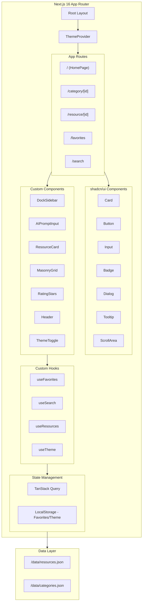

# Design Document: 设计百宝箱 (Design Treasure Box)

## Overview

设计百宝箱是一个面向设计师和开发者的精选设计资源聚合应用。采用 Next.js 16 + shadcn/ui + Tailwind CSS 4 技术栈，参考 Lovart 的简约风格，左侧 macOS 风格 Dock 导航（紧凑居中），底部固定 AI Prompt 输入框，瀑布流卡片展示资源。支持深色/浅色主题切换。

### Design Specification

```
DESIGN SPECIFICATION
====================
1. Purpose Statement: 为设计师和开发者提供一个高审美门槛的设计资源聚合入口，
   解决优质设计网站难以管理和查找的痛点，通过专业策展和评分帮助用户发现高质量资源。
   参考 Lovart 的简约优雅风格，打造沉浸式浏览体验。

2. Aesthetic Direction: Brutally minimal (极简主义)
   - macOS 风格的简约 Dock 侧边栏
   - 大面积留白，内容为王
   - 瀑布流卡片布局，Pinterest 风格
   - 底部悬浮 AI Prompt 输入框，类似 ChatGPT 风格
   - 毛玻璃效果和微妙阴影

3. Color Palette (支持深色/浅色双主题):
   
   浅色模式 (Light):
   - Background: #FAFAFA (浅灰白) - 主背景
   - Surface: #FFFFFF (纯白) - 卡片/Dock背景
   - Border: #E5E5E5 (浅灰) - 边框/分割线
   - Text Primary: #171717 (近黑) - 主文字
   - Text Secondary: #737373 (中灰) - 次要文字
   - Accent: #000000 (纯黑) - 强调/按钮
   - Highlight: #F59E0B (琥珀) - 评分星星
   
   深色模式 (Dark):
   - Background: #0A0A0A (近黑) - 主背景
   - Surface: #171717 (深灰) - 卡片/Dock背景
   - Border: #262626 (暗灰) - 边框/分割线
   - Text Primary: #FAFAFA (浅灰白) - 主文字
   - Text Secondary: #A3A3A3 (中灰) - 次要文字
   - Accent: #FFFFFF (纯白) - 强调/按钮
   - Highlight: #FBBF24 (明亮琥珀) - 评分星星

4. Typography:
   - Display: 'SF Pro Display', -apple-system, sans-serif (标题)
   - Body: 'SF Pro Text', -apple-system, sans-serif (正文)
   - Mono: 'SF Mono', monospace (标签/代码)
   注：使用系统字体栈确保 macOS 原生感

5. Layout Strategy:
   - 左侧固定 macOS Dock 风格导航栏 (64px 宽)
   - 顶部简洁 Header (Logo + 分类标签 + 用户操作)
   - 主内容区瀑布流/Masonry 布局
   - 底部固定悬浮 AI Prompt 输入框 (毛玻璃背景)
   - 卡片悬停时微妙上浮效果
```

## Architecture



### 技术栈详情

| 技术 | 版本 | 用途 |
|------|------|------|
| Next.js | 16.x | App Router, SSG/SSR, 文件路由 |
| React | 19.x | UI 框架 |
| shadcn/ui | latest | UI 组件库 (基于 Radix UI) |
| Tailwind CSS | 4.x | 原子化 CSS |
| TanStack Query | 5.x | 数据获取与缓存 |
| React Hook Form | 7.x | 表单处理 |
| Zod | 3.x | 数据验证 |
| Lucide React | latest | 图标库 (禁止使用 emoji) |
| next-themes | latest | 深色/浅色主题切换 |

## Components and Interfaces

### Core Data Interfaces

```typescript
// 资源条目接口
interface Resource {
  id: string;
  name: string;
  url: string;
  description: string;
  screenshot: string;
  categoryId: string;
  tags: string[];
  rating: Rating;
  curatorNote: string;
  isFeatured: boolean;
  createdAt: string;
  viewCount: number;
  favoriteCount: number;
}

// 评分接口
interface Rating {
  overall: number;        // 综合评分 0-5
  usability: number;      // 实用性
  aesthetics: number;     // 美观度
  updateFrequency: number; // 更新频率
  freeLevel: number;      // 免费程度
}

// 分类接口
interface Category {
  id: string;
  name: string;
  icon: string;           // Lucide icon name
  description: string;
  color: string;          // 分类主题色
}

// 收藏项接口
interface FavoriteItem {
  resourceId: string;
  addedAt: string;
}
```

### shadcn/ui 组件使用

| 组件 | 用途 |
|------|------|
| `Card` | 资源卡片容器 |
| `Button` | 操作按钮 (收藏、访问、提交) |
| `Input` | AI Prompt 输入框 |
| `Badge` | 标签、精选标识 |
| `Dialog` | 资源详情弹窗 (可选) |
| `Tooltip` | Dock 图标提示 |
| `ScrollArea` | 主内容区滚动 |
| `Skeleton` | 加载占位 |

### Component Hierarchy

```
RootLayout
├── ThemeProvider (next-themes)
├── DockSidebar (左侧固定 64px, 垂直居中紧凑型)
│   └── DockItem[] (Lucide 图标 + Tooltip)
├── MainWrapper
│   ├── Header (顶部)
│   │   ├── Logo
│   │   ├── CategoryTabs (分类标签切换)
│   │   ├── ThemeToggle (深色/浅色切换)
│   │   └── UserActions (收藏入口)
│   ├── MainContent (中间滚动区)
│   │   ├── HomePage
│   │   │   ├── FeaturedSection (精选横向滚动)
│   │   │   └── MasonryGrid (瀑布流)
│   │   ├── CategoryPage
│   │   │   ├── CategoryHeader
│   │   │   └── MasonryGrid
│   │   ├── ResourceDetailPage
│   │   │   ├── ResourceHero
│   │   │   ├── RatingBreakdown
│   │   │   └── RelatedResources
│   │   ├── FavoritesPage
│   │   │   └── MasonryGrid
│   │   └── SearchResultsPage
│   │       └── MasonryGrid
│   └── AIPromptInput (底部固定悬浮)
│       ├── Input (毛玻璃背景)
│       └── SubmitButton
└── Footer (可选，极简)
```

### 自定义组件规格

#### DockSidebar
```typescript
interface DockSidebarProps {
  categories: Category[];
  activeCategory?: string;
  onCategoryClick: (categoryId: string) => void;
}
// 样式: 固定左侧 64px, 垂直居中图标, 悬停放大效果
```

#### AIPromptInput
```typescript
interface AIPromptInputProps {
  onSubmit: (prompt: string) => void;
  placeholder?: string;
  isLoading?: boolean;
}
// 样式: 固定底部, 毛玻璃背景, 圆角输入框, 发送按钮
```

#### MasonryGrid
```typescript
interface MasonryGridProps {
  resources: Resource[];
  columns?: 2 | 3 | 4;
  gap?: number;
}
// 样式: CSS Grid + masonry 布局, 响应式列数
```

#### ResourceCard
```typescript
interface ResourceCardProps {
  resource: Resource;
  isFavorited: boolean;
  onFavorite: () => void;
  onVisit: () => void;
}
// 样式: 圆角卡片, 悬停上浮, 图片 16:10 比例
```

## Data Models

### 预置分类数据

```typescript
const categories: Category[] = [
  { id: 'color', name: '配色工具', icon: 'Palette', description: '调色板、配色方案生成器', color: '#E94560' },
  { id: 'css', name: 'CSS模板', icon: 'Code', description: 'CSS框架、样式库、动画效果', color: '#00D9FF' },
  { id: 'font', name: '字体资源', icon: 'Type', description: '免费字体、字体配对工具', color: '#F8B500' },
  { id: 'icon', name: '图标库', icon: 'Shapes', description: '图标集、SVG资源', color: '#7B68EE' },
  { id: 'inspiration', name: '设计灵感', icon: 'Sparkles', description: '优秀设计案例、灵感画廊', color: '#FF6B6B' },
  { id: 'website', name: '网站案例', icon: 'Globe', description: '优秀网站设计展示', color: '#4ECDC4' },
  { id: 'ui-kit', name: 'UI组件', icon: 'Layout', description: 'UI Kit、设计系统', color: '#95E1D3' },
  { id: 'mockup', name: '样机素材', icon: 'Smartphone', description: '设备样机、场景模板', color: '#DDA0DD' },
];
```

### 本地存储结构

```typescript
// localStorage key: 'design-treasure-box-favorites'
interface StoredFavorites {
  version: number;
  items: FavoriteItem[];
  lastUpdated: string;
}
```

## Correctness Properties

*A property is a characteristic or behavior that should hold true across all valid executions of a system—essentially, a formal statement about what the system should do. Properties serve as the bridge between human-readable specifications and machine-verifiable correctness guarantees.*

### Property 1: 资源数据完整性
*For any* Resource object in the system, it SHALL contain all required fields: name, url, description, screenshot, categoryId, tags (non-empty array), rating (with all dimensions), and curatorNote.
**Validates: Requirements 1.3, 2.3**

### Property 2: 分类筛选正确性
*For any* category selection, all returned resources SHALL have a categoryId matching the selected category.
**Validates: Requirements 1.2**

### Property 3: 搜索筛选正确性
*For any* search query and tag filter combination, all returned resources SHALL either contain the search keyword in name/description/tags OR contain all selected tags.
**Validates: Requirements 3.1, 3.2, 3.3**

### Property 4: 收藏操作 Round-Trip
*For any* resource, adding it to favorites then removing it SHALL result in the favorites list being unchanged from the original state.
**Validates: Requirements 4.1, 4.4**

### Property 5: 收藏持久化
*For any* favorites list state, storing to localStorage then retrieving SHALL produce an equivalent list.
**Validates: Requirements 4.5**

### Property 6: 评分范围约束
*For any* Rating object, all rating values (overall, usability, aesthetics, updateFrequency, freeLevel) SHALL be in the range [0, 5] with 0.5 precision.
**Validates: Requirements 2.1**

### Property 7: 排序正确性
*For any* list of resources sorted by viewCount/favoriteCount (descending) or createdAt (descending), the resulting order SHALL be monotonically non-increasing by the sort key.
**Validates: Requirements 5.2, 5.3**

### Property 8: 精选标识一致性
*For any* resource with isFeatured=true, the rendered ResourceCard SHALL display the featured badge element.
**Validates: Requirements 5.4**

### Property 9: 预置数据完整性
*For any* category in the system, there SHALL exist at least one resource with that categoryId in the preset data, and all preset resources SHALL have valid rating and non-empty tags.
**Validates: Requirements 8.2, 8.3**

### Property 10: 详情页数据完整性
*For any* resource detail page, the rendered content SHALL include: screenshot, full description, all tags, rating breakdown (all dimensions), and at least one related resource.
**Validates: Requirements 6.2**

## Error Handling

### 错误场景处理

| 场景 | 处理策略 |
|------|----------|
| 资源图片加载失败 | 显示占位图，带分类图标 |
| LocalStorage 不可用 | 降级为内存存储，提示用户 |
| 搜索无结果 | 显示热门推荐和搜索建议 |
| 资源链接失效 | 标记为"待验证"，显示警告 |
| 数据解析错误 | 使用默认值，记录错误日志 |

### 错误边界

```typescript
// 组件级错误边界
class ResourceErrorBoundary extends React.Component {
  state = { hasError: false };
  
  static getDerivedStateFromError() {
    return { hasError: true };
  }
  
  render() {
    if (this.state.hasError) {
      return <ErrorFallback message="资源加载失败" />;
    }
    return this.props.children;
  }
}
```

## Testing Strategy

### 双重测试方法

本项目采用单元测试和属性测试相结合的测试策略：

- **单元测试**: 验证具体示例、边界情况和错误条件
- **属性测试**: 验证跨所有输入的通用属性

### 测试框架

- **单元测试**: Vitest + React Testing Library
- **属性测试**: fast-check (JavaScript PBT 库)
- **E2E 测试**: Playwright (可选)
- **最小迭代次数**: 每个属性测试 100 次

### Next.js 测试配置

```typescript
// vitest.config.ts
import { defineConfig } from 'vitest/config'
import react from '@vitejs/plugin-react'

export default defineConfig({
  plugins: [react()],
  test: {
    environment: 'jsdom',
    setupFiles: ['./tests/setup.ts'],
    include: ['**/*.test.{ts,tsx}'],
  },
})
```

### 测试覆盖范围

| 测试类型 | 覆盖内容 |
|----------|----------|
| 单元测试 | 组件渲染、用户交互、边界情况 |
| 属性测试 | 数据完整性、搜索筛选、收藏操作、排序逻辑 |
| 集成测试 | 页面导航、状态持久化 |

### 属性测试标注格式

```typescript
// Feature: design-treasure-box, Property 3: 搜索筛选正确性
// Validates: Requirements 3.1, 3.2, 3.3
test.prop([resourceArb, searchQueryArb, tagsArb], (resources, query, tags) => {
  const results = filterResources(resources, query, tags);
  return results.every(r => 
    matchesQuery(r, query) || containsAllTags(r, tags)
  );
});
```

## UI/UX Design Details

### 整体布局结构

```
┌──────────────────────────────────────────────────────────────────────────┐
│                              HEADER                                       │
│  [Logo]   [全部] [配色] [CSS] [字体] [图标] [灵感] ...  [Sun/Moon] [Heart]│
├────────┬─────────────────────────────────────────────────────────────────┤
│        │                                                                  │
│        │                      MAIN CONTENT                                │
│        │                                                                  │
│ ┌────┐ │   ┌─────────────────────────────────────────────────────────┐   │
│ │DOCK│ │   │  [Sparkles] 编辑精选                     [查看全部 ->]  │   │
│ │    │ │   │  ┌────┐ ┌────┐ ┌────┐ ┌────┐ ┌────┐                    │   │
│ │[Pa]│ │   │  │    │ │    │ │    │ │    │ │    │  <- 横向滚动       │   │
│ │[Co]│ │   │  └────┘ └────┘ └────┘ └────┘ └────┘                    │   │
│ │[Ty]│ │   └─────────────────────────────────────────────────────────┘   │
│ │[Sh]│ │                                                                  │
│ │[Sp]│ │   ┌─────────────────────────────────────────────────────────┐   │
│ │[Gl]│ │   │  MASONRY GRID (瀑布流)                                   │   │
│ │[La]│ │   │  ┌──────┐ ┌────────┐ ┌──────┐ ┌────────┐               │   │
│ │[Sm]│ │   │  │      │ │        │ │      │ │        │               │   │
│ │    │ │   │  │ Card │ │  Card  │ │ Card │ │  Card  │               │   │
│ │----│ │   │  │      │ │        │ │      │ │        │               │   │
│ │[He]│ │   │  └──────┘ │        │ └──────┘ │        │               │   │
│ └────┘ │   │  ┌──────┐ └────────┘ ┌──────┐ └────────┘               │   │
│        │   │  │      │ ┌────────┐ │      │ ┌────────┐               │   │
│ 垂直   │   │  │ Card │ │  Card  │ │ Card │ │  Card  │               │   │
│ 居中   │   │  └──────┘ └────────┘ └──────┘ └────────┘               │   │
│        │   └─────────────────────────────────────────────────────────┘   │
│        │                                                                  │
├────────┴─────────────────────────────────────────────────────────────────┤
│  ┌─────────────────────────────────────────────────────────────────────┐ │
│  │  [MessageSquare] 输入你想要的设计资源，AI 帮你找...           [->] │ │
│  └─────────────────────────────────────────────────────────────────────┘ │
│                         AI PROMPT INPUT (毛玻璃悬浮, 滚动时隐藏)          │
└──────────────────────────────────────────────────────────────────────────┘

图标说明 (Lucide React):
[Pa] = Palette (配色工具)
[Co] = Code (CSS模板)
[Ty] = Type (字体资源)
[Sh] = Shapes (图标库)
[Sp] = Sparkles (设计灵感)
[Gl] = Globe (网站案例)
[La] = Layout (UI组件)
[Sm] = Smartphone (样机素材)
[He] = Heart (我的收藏)
[Sun/Moon] = Sun/Moon (主题切换)
[MessageSquare] = MessageSquare (AI输入提示)
```

### macOS Dock 侧边栏设计 (紧凑居中型，参考 Lovart)

```
│        │
│        │
│        │
│ ┌────┐ │
│ │[Pa]│ │  <- Palette (配色工具)
│ │[Co]│ │  <- Code (CSS模板)
│ │[Ty]│ │  <- Type (字体资源)
│ │[Sh]│ │  <- Shapes (图标库)
│ │[Sp]│ │  <- Sparkles (设计灵感)
│ │[Gl]│ │  <- Globe (网站案例)
│ │[La]│ │  <- Layout (UI组件)
│ │[Sm]│ │  <- Smartphone (样机素材)
│ │----│ │  <- 分隔线
│ │[He]│ │  <- Heart (我的收藏)
│ └────┘ │
│        │
│        │
│        │

样式规格 (紧凑居中，参考 Lovart):
- 宽度: 64px
- 高度: auto (内容自适应，不铺满整个视口高度)
- 位置: 固定左侧，垂直居中 (top: 50%, transform: translateY(-50%))
- 背景: 
  - 浅色模式: rgba(255,255,255,0.9) + backdrop-blur-xl
  - 深色模式: rgba(30,30,30,0.9) + backdrop-blur-xl
- 圆角: 16px (整体容器)
- 边框: 1px solid var(--border)
- 阴影: 0 4px 24px rgba(0,0,0,0.08)
- 图标大小: 24px
- 图标容器: 40px x 40px
- 图标间距: 4px
- 内边距: 8px
- 悬停效果: scale(1.15) + 背景高亮圆角
- 激活状态: 左侧 2px 竖线指示器
- 图标库: Lucide React (禁止使用 emoji)
```

### AI Prompt 输入框设计

```
┌─────────────────────────────────────────────────────────────────────────┐
│  ┌───────────────────────────────────────────────────────────────────┐  │
│  │  [MessageSquare]  输入你想要的设计资源，AI 帮你找...   [ArrowUp] │  │
│  └───────────────────────────────────────────────────────────────────┘  │
└─────────────────────────────────────────────────────────────────────────┘

图标: MessageSquare (左侧提示), ArrowUp (发送按钮)

样式规格:
- 位置: 固定底部, 距底 24px, 水平居中于主内容区
- 宽度: max-w-2xl (672px), 居中显示
- 高度: 56px
- 背景: 
  - 浅色模式: rgba(255,255,255,0.9) + backdrop-blur-xl
  - 深色模式: rgba(30,30,30,0.9) + backdrop-blur-xl
- 边框: 1px solid var(--border)
- 圆角: 28px (胶囊形)
- 阴影: 
  - 浅色模式: 0 4px 24px rgba(0,0,0,0.1)
  - 深色模式: 0 4px 24px rgba(0,0,0,0.3)
- 输入框: 无边框, 透明背景
- 发送按钮: 圆形, accent 背景, 白色 ArrowUp 图标

滚动行为:
- 默认状态: 正常显示, opacity: 1, translateY: 0
- 滚动中: 隐藏, opacity: 0, translateY: 20px, pointer-events: none
- 滚动停止 300ms 后: 渐显恢复
- 过渡动画: 200ms ease-out
- 实现: 使用 useScrollDirection hook 监听滚动状态
```

### AI Prompt 滚动隐藏实现

```typescript
// hooks/useScrollVisibility.ts
'use client'
import { useState, useEffect, useRef } from 'react'

export function useScrollVisibility(hideDelay = 300) {
  const [isVisible, setIsVisible] = useState(true)
  const scrollTimeoutRef = useRef<NodeJS.Timeout | null>(null)
  const lastScrollY = useRef(0)

  useEffect(() => {
    const handleScroll = () => {
      const currentScrollY = window.scrollY
      const isScrolling = currentScrollY !== lastScrollY.current
      lastScrollY.current = currentScrollY

      if (isScrolling) {
        setIsVisible(false)
        
        // 清除之前的定时器
        if (scrollTimeoutRef.current) {
          clearTimeout(scrollTimeoutRef.current)
        }
        
        // 滚动停止后延迟显示
        scrollTimeoutRef.current = setTimeout(() => {
          setIsVisible(true)
        }, hideDelay)
      }
    }

    window.addEventListener('scroll', handleScroll, { passive: true })
    return () => {
      window.removeEventListener('scroll', handleScroll)
      if (scrollTimeoutRef.current) {
        clearTimeout(scrollTimeoutRef.current)
      }
    }
  }, [hideDelay])

  return isVisible
}

// components/AIPromptInput.tsx 使用示例
export function AIPromptInput({ onSubmit }: AIPromptInputProps) {
  const isVisible = useScrollVisibility(300)
  
  return (
    <div
      className={cn(
        "fixed bottom-6 left-1/2 -translate-x-1/2 z-50",
        "max-w-2xl w-full px-4",
        "transition-all duration-200 ease-out",
        isVisible 
          ? "opacity-100 translate-y-0" 
          : "opacity-0 translate-y-5 pointer-events-none"
      )}
    >
      {/* 输入框内容 */}
    </div>
  )
}
```

### 资源卡片设计 (瀑布流)

```
┌────────────────────────────┐
│  ┌──────────────────────┐  │
│  │                      │  │
│  │    SCREENSHOT        │  │  <- 网站截图 (自适应高度)
│  │                      │  │
│  │  [Sparkles] FEATURED │  │  <- 精选标识 (左上角, Sparkles 图标)
│  └──────────────────────┘  │
│                            │
│  Resource Name             │  <- 资源名称 (SF Pro Display, 16px)
│  [Star][Star][Star][Star][StarHalf] 4.5  <- 评分星星 (Star 图标)
│                            │
│  Brief description...      │  <- 简介 (2行截断)
│                            │
│  [配色] [免费] [工具]      │  <- 标签 (Badge 组件)
│                            │
│  [Heart]      [ExternalLink] 访问  <- 操作按钮 (Lucide 图标)
└────────────────────────────┘

图标: Sparkles (精选), Star/StarHalf (评分), Heart (收藏), ExternalLink (访问)

样式规格:
- 背景: 
  - 浅色模式: var(--surface) (#FFFFFF)
  - 深色模式: var(--surface-dark) (#1E1E1E)
- 圆角: 12px
- 阴影: 
  - 浅色模式: 0 1px 3px rgba(0,0,0,0.1)
  - 深色模式: 0 1px 3px rgba(0,0,0,0.3)
- 悬停: translateY(-4px) + shadow 增强
- 图片: object-fit: cover, 圆角顶部
- 内边距: 16px (内容区)
```

### 响应式断点

| 断点 | 宽度 | Dock | 瀑布流列数 | AI Input |
|------|------|------|-----------|----------|
| Desktop XL | ≥1440px | 显示 | 5列 | 居中 max-w-3xl |
| Desktop | ≥1200px | 显示 | 4列 | 居中 max-w-2xl |
| Tablet | 768-1199px | 折叠为图标 | 3列 | 全宽 -48px |
| Mobile | <768px | 底部 Tab Bar | 2列 | 全宽 -32px |

### 动效设计

| 元素 | 动效 | 时长 | 缓动 |
|------|------|------|------|
| 卡片悬停 | translateY(-4px) + shadow | 200ms | ease-out |
| Dock 图标悬停 | scale(1.2) | 150ms | spring |
| 页面切换 | fade + slide | 300ms | ease-in-out |
| 收藏按钮 | heart pulse + scale | 400ms | bounce |
| AI Input 聚焦 | border glow | 200ms | ease |
| AI Input 滚动隐藏 | opacity(0) + translateY(20px) | 200ms | ease-out |
| AI Input 滚动恢复 | opacity(1) + translateY(0) | 200ms | ease-out |
| 瀑布流加载 | stagger fade-in | 50ms/item | ease-out |

### 颜色系统 (Tailwind CSS 4 + next-themes)

```css
/* globals.css - 双主题颜色系统 */

/* 浅色模式 (默认) */
:root {
  --background: #FAFAFA;
  --surface: #FFFFFF;
  --border: #E5E5E5;
  --text-primary: #171717;
  --text-secondary: #737373;
  --text-muted: #A3A3A3;
  --accent: #000000;
  --accent-foreground: #FFFFFF;
  --highlight: #F59E0B;
  --glass: rgba(255, 255, 255, 0.8);
  --glass-border: rgba(0, 0, 0, 0.05);
  --shadow: rgba(0, 0, 0, 0.1);
  --shadow-strong: rgba(0, 0, 0, 0.15);
}

/* 深色模式 */
.dark {
  --background: #0A0A0A;
  --surface: #171717;
  --border: #262626;
  --text-primary: #FAFAFA;
  --text-secondary: #A3A3A3;
  --text-muted: #737373;
  --accent: #FFFFFF;
  --accent-foreground: #000000;
  --highlight: #FBBF24;
  --glass: rgba(23, 23, 23, 0.8);
  --glass-border: rgba(255, 255, 255, 0.1);
  --shadow: rgba(0, 0, 0, 0.3);
  --shadow-strong: rgba(0, 0, 0, 0.5);
}

/* Tailwind CSS 4 主题配置 */
@theme {
  --color-background: var(--background);
  --color-surface: var(--surface);
  --color-border: var(--border);
  --color-text-primary: var(--text-primary);
  --color-text-secondary: var(--text-secondary);
  --color-text-muted: var(--text-muted);
  --color-accent: var(--accent);
  --color-accent-foreground: var(--accent-foreground);
  --color-highlight: var(--highlight);
}
```

### 主题切换实现

```typescript
// app/layout.tsx
import { ThemeProvider } from 'next-themes'

export default function RootLayout({ children }) {
  return (
    <html lang="zh-CN" suppressHydrationWarning>
      <body>
        <ThemeProvider
          attribute="class"
          defaultTheme="system"
          enableSystem
          disableTransitionOnChange
        >
          {children}
        </ThemeProvider>
      </body>
    </html>
  )
}

// components/ThemeToggle.tsx
'use client'
import { useTheme } from 'next-themes'
import { Sun, Moon } from 'lucide-react'
import { Button } from '@/components/ui/button'

export function ThemeToggle() {
  const { theme, setTheme } = useTheme()
  
  return (
    <Button
      variant="ghost"
      size="icon"
      onClick={() => setTheme(theme === 'dark' ? 'light' : 'dark')}
    >
      <Sun className="h-5 w-5 rotate-0 scale-100 transition-all dark:-rotate-90 dark:scale-0" />
      <Moon className="absolute h-5 w-5 rotate-90 scale-0 transition-all dark:rotate-0 dark:scale-100" />
      <span className="sr-only">切换主题</span>
    </Button>
  )
}
```
