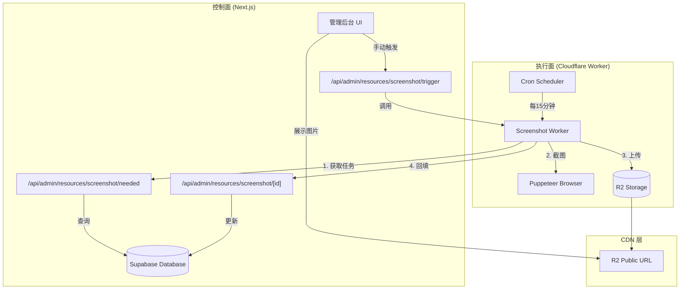
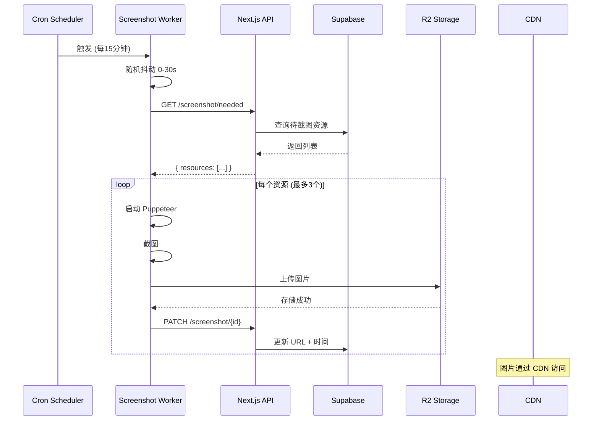
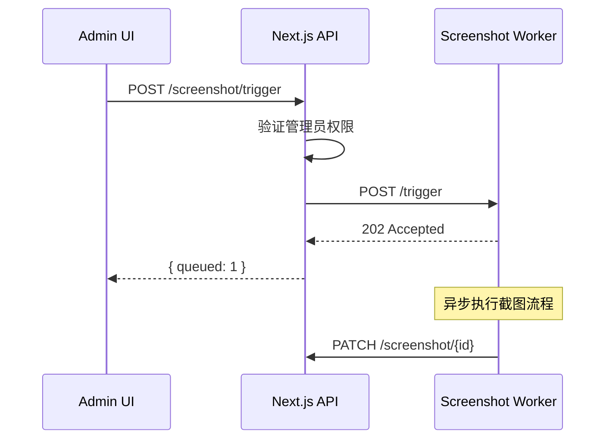

# 截图服务架构说明 (Screenshot Service Architecture)

## 概述

设计百宝箱的截图服务采用**控制面与执行面分离**的架构设计，实现了 Next.js 应用（控制面）与 Cloudflare Worker（执行面）的清晰解耦。



---

## 核心组件详解

### 1. Cloudflare Worker (执行面)

**文件**: [workers/screenshot-service/src/index.ts](file:///Users/jerry/codebuddy/design-treasure-box/workers/screenshot-service/src/index.ts)

#### 1.1 触发方式

| 触发方式     | 入口            | 说明                                |
| ------------ | --------------- | ----------------------------------- |
| **定时任务** | `scheduled()`   | 每 15 分钟执行一次 (`*/15 * * * *`) |
| **手动触发** | `POST /trigger` | 管理员通过 UI 手动触发              |

#### 1.2 核心流程 (`runScreenshotSync`)

```
1. 随机抖动 (仅定时任务)
   ↓
2. 调用 Next.js API 获取待处理资源
   GET /api/admin/resources/screenshot/needed
   ↓
3. 启动 Puppeteer 浏览器
   ↓
4. 循环处理每个资源 (最多 3 个)
   ├── 打开页面、设置视口
   ├── 等待页面加载 (networkidle2 + 3秒)
   ├── 截图 (JPEG, 质量 80)
   ├── 上传到 R2 存储
   └── 回填截图 URL 到数据库
   ↓
5. 关闭浏览器
```

#### 1.3 关键配置

| 配置项               | 值       | 说明           |
| -------------------- | -------- | -------------- |
| `SCREENSHOT_TIMEOUT` | 30000ms  | 页面加载超时   |
| `WAIT_AFTER_LOAD`    | 3000ms   | 渲染稳定等待   |
| `VIEWPORT_CONFIG`    | 1200×800 | 截图分辨率     |
| `JPEG_QUALITY`       | 80       | 图片质量       |
| 单次处理上限         | 3 个     | 免费版并发限制 |

---

### 2. Next.js API 端点 (控制面)

#### 2.1 获取待截图资源

**端点**: `GET /api/admin/resources/screenshot/needed`

**文件**: [app/api/admin/resources/screenshot/needed/route.ts](file:///Users/jerry/codebuddy/design-treasure-box/app/api/admin/resources/screenshot/needed/route.ts)

**职责**: 返回需要截图的资源列表（增量过滤）

**过滤条件**:

```sql
screenshot_url IS NULL          -- 从未截图
OR
screenshot_updated_at < NOW() - 7 days  -- 截图已过期
```

**响应格式**:

```json
{
  "success": true,
  "total": 3,
  "resources": [{ "id": "uuid", "url": "https://..." }]
}
```

---

#### 2.2 触发截图生成

**端点**: `POST /api/admin/resources/screenshot/trigger`

**文件**: [app/api/admin/resources/screenshot/trigger/route.ts](file:///Users/jerry/codebuddy/design-treasure-box/app/api/admin/resources/screenshot/trigger/route.ts)

**职责**: 代理前端请求到 Worker

**鉴权方式**:

1. 优先验证管理员 Session
2. 备选：验证 `DATABASE_API_KEY`

**限制**: 单次最多 10 个资源

**流程**:

```
Admin UI → POST /trigger → Worker /trigger → 异步执行截图
```

---

#### 2.3 更新截图信息

**端点**: `PATCH /api/admin/resources/screenshot/[id]`

**文件**: [app/api/admin/resources/screenshot/[id]/route.ts](file:///Users/jerry/codebuddy/design-treasure-box/app/api/admin/resources/screenshot/%5Bid%5D/route.ts)

**职责**: 接收 Worker 回填的截图结果

**支持字段**:
| 字段 | 类型 | 说明 |
|-----|------|------|
| `screenshotUrl` | string | 截图 CDN URL |
| `screenshotUpdatedAt` | ISO8601 | 更新时间 |
| `screenshotError` | string | 错误信息（失败时） |

**更新逻辑**:

- 成功时：设置 URL + 时间，清空 error
- 失败时：记录 error（截断到 500 字符）

---

### 3. 管理后台 UI (展示层)

#### 3.1 资源表格

**文件**: [components/admin/resource-table.tsx](file:///Users/jerry/codebuddy/design-treasure-box/components/admin/resource-table.tsx)

**截图状态判定**:

```typescript
function getScreenshotStatus(resource): 'success' | 'pending' | 'failed' {
  // 优先级 1: 有错误 → failed (红色)
  if (resource.screenshot_error) return 'failed';

  // 优先级 2: 无截图 → pending (黄色)
  if (!resource.screenshot_url) return 'pending';

  // 优先级 3: 截图过期 (>7天) → pending
  if (isOutdated(resource.screenshot_updated_at)) return 'pending';

  // 其他情况 → success (绿色)
  return 'success';
}
```

**UI 功能**:

- 🟢 已生成：显示更新时间
- 🟡 待更新：等待截图生成
- 🔴 失败：显示错误原因 (Tooltip)
- 📸 手动触发按钮：调用 `/trigger` 端点

---

#### 3.2 截图服务概览卡片

**文件**: [components/admin/screenshot-service-card.tsx](file:///Users/jerry/codebuddy/design-treasure-box/components/admin/screenshot-service-card.tsx)

**展示内容**:

- 成功数、待更新数、失败数
- 成功率百分比
- 批量重截失败资源按钮（限流 10 个）

---

## 数据流图

### 自动截图流程 (定时任务)



### 手动触发流程



---

## 环境变量配置

### Next.js 端

| 变量名             | 用途                  |
| ------------------ | --------------------- |
| `DATABASE_API_KEY` | Worker ↔ API 通信密钥 |
| `WORKER_API_URL`   | Worker 的公网地址     |

### Worker 端 (wrangler.jsonc)

| 变量名             | 值                             | 用途             |
| ------------------ | ------------------------------ | ---------------- |
| `R2_PUBLIC_URL`    | `https://images.thepexels.top` | 图片 CDN 域名    |
| `API_BASE_URL`     | `https://design.thepexels.top` | Next.js API 地址 |
| `DATABASE_API_KEY` | `sb_secret_...`                | 通信密钥         |

---

## 安全设计

### API 鉴权

```
Worker → API: Bearer ${DATABASE_API_KEY}
Admin UI → API: Supabase Session (requireAdmin)
```

### 机器人防护

Worker 入口拦截所有非授权请求：

```typescript
if (path !== '/health' && authHeader !== expectedAuth) {
  console.warn(`🛡️ 拦截到未授权访问: ${path}`);
  return new Response('Unauthorized', { status: 401 });
}
```

---

## 数据库字段

`resources` 表扩展字段：

| 字段                    | 类型      | 说明                   |
| ----------------------- | --------- | ---------------------- |
| `screenshot_url`        | text      | 截图 CDN URL           |
| `screenshot_updated_at` | timestamp | 最后更新时间           |
| `screenshot_error`      | text      | 错误信息 (最长500字符) |

---

## 已知限制

1. **免费版并发限制**: 单次最多处理 3 个资源
2. **Cron 最小间隔**: 15 分钟
3. **浏览器 429 限制**: 高峰期可能触发 Cloudflare 频率限制
4. **截图过期策略**: 7 天强制刷新

---

## 关键文件索引

| 文件                                                                                                                                                         | 职责            |
| ------------------------------------------------------------------------------------------------------------------------------------------------------------ | --------------- |
| [workers/screenshot-service/src/index.ts](file:///Users/jerry/codebuddy/design-treasure-box/workers/screenshot-service/src/index.ts)                         | Worker 核心逻辑 |
| [workers/screenshot-service/wrangler.jsonc](file:///Users/jerry/codebuddy/design-treasure-box/workers/screenshot-service/wrangler.jsonc)                     | Worker 配置     |
| [app/api/admin/resources/screenshot/needed/route.ts](file:///Users/jerry/codebuddy/design-treasure-box/app/api/admin/resources/screenshot/needed/route.ts)   | 获取待截图列表  |
| [app/api/admin/resources/screenshot/trigger/route.ts](file:///Users/jerry/codebuddy/design-treasure-box/app/api/admin/resources/screenshot/trigger/route.ts) | 触发截图        |
| [app/api/admin/resources/screenshot/[id]/route.ts](file:///Users/jerry/codebuddy/design-treasure-box/app/api/admin/resources/screenshot/%5Bid%5D/route.ts)   | 回填结果        |
| [components/admin/resource-table.tsx](file:///Users/jerry/codebuddy/design-treasure-box/components/admin/resource-table.tsx)                                 | 资源表格 UI     |
| [components/admin/screenshot-service-card.tsx](file:///Users/jerry/codebuddy/design-treasure-box/components/admin/screenshot-service-card.tsx)               | 概览卡片        |
| [lib/screenshot-service.ts](file:///Users/jerry/codebuddy/design-treasure-box/lib/screenshot-service.ts)                                                     | 前端调用封装    |
