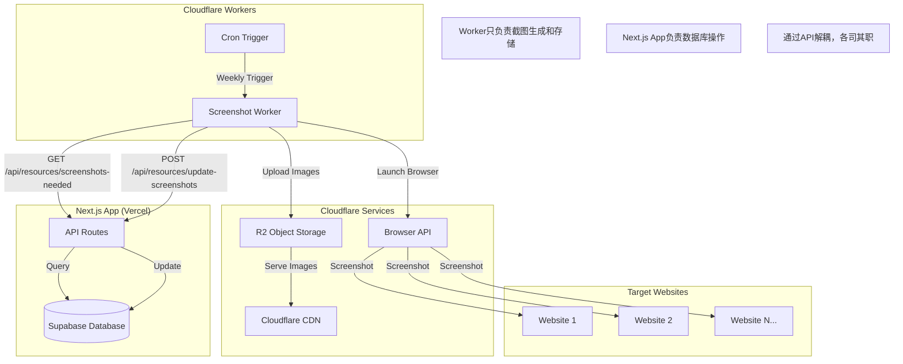

# Design Document

## Overview

设计百宝箱截图服务是一个基于 Cloudflare Workers 的分布式截图生成系统。该系统通过定时任务自动为设计资源网站生成高质量截图，并通过 Cloudflare 的全球 CDN 网络提供快速的图片访问服务。

系统采用无服务器架构，具有高可用性、自动扩展和成本效益的特点。通过增量更新机制，系统只处理需要更新的资源，大大提高了效率并降低了运行成本。

## Architecture

### 系统架构图



### 核心组件

1. **Screenshot Worker**: 专注于截图生成和文件存储的 Cloudflare Worker
2. **Cron Scheduler**: 定时任务调度器，每周触发截图更新
3. **Browser Service**: Cloudflare Browser API，提供无头浏览器功能
4. **R2 Storage**: 对象存储服务，存储生成的截图文件
5. **CDN Network**: 全球内容分发网络，提供快速的图片访问
6. **Next.js API Routes**: 处理数据库操作的API端点，与Worker解耦

## Components and Interfaces

### Screenshot Worker Interface

```typescript
export interface Env {
  SCREENSHOT_BUCKET: R2Bucket        // R2 存储桶
  MYBROWSER: Fetcher                 // Browser API
  NEXTJS_API_URL: string            // Next.js API 基础URL
  API_SECRET_KEY: string            // API 认证密钥
}

export interface ScreenshotWorker {
  fetch(request: Request, env: Env): Promise<Response>
  scheduled(event: ScheduledEvent, env: Env, ctx: ExecutionContext): Promise<void>
}
```

### API Integration Interface

```typescript
// Worker调用的Next.js API端点
interface NextjsApiEndpoints {
  // 获取需要截图的资源列表
  getResourcesNeedingScreenshots(): Promise<Resource[]>
  
  // 批量更新截图URL
  updateScreenshotUrls(updates: ScreenshotUpdate[]): Promise<UpdateResult>
}

interface ScreenshotUpdate {
  resourceId: string
  screenshotUrl: string
  screenshotUpdatedAt: string
}

interface UpdateResult {
  successful: number
  failed: number
  errors?: string[]
}
```

### Resource Management Interface

```typescript
interface Resource {
  id: string
  name: string
  url: string
  screenshot_url?: string
  screenshot_updated_at?: string
}

interface ScreenshotService {
  fetchAllResources(env: Env): Promise<Resource[]>
  filterResourcesForUpdate(resources: Resource[]): Resource[]
  generateAndUploadScreenshot(resource: Resource, env: Env): Promise<string>
  updateResourceScreenshot(resourceId: string, screenshotUrl: string, env: Env): Promise<void>
}
```

### Browser Automation Interface

```typescript
interface BrowserService {
  launchBrowser(env: Env): Promise<Browser>
  configurePageSettings(page: Page): Promise<void>
  blockUnnecessaryResources(page: Page): Promise<void>
  hidePageElements(page: Page): Promise<void>
  captureScreenshot(page: Page, url: string): Promise<Buffer>
}
```

### Storage Management Interface

```typescript
interface StorageService {
  uploadScreenshot(
    bucket: R2Bucket, 
    filename: string, 
    screenshot: Buffer, 
    metadata: ScreenshotMetadata
  ): Promise<void>
  
  generateCDNUrl(filename: string): string
  handleImageRequest(request: Request, env: Env): Promise<Response>
}

interface ScreenshotMetadata {
  resourceId: string
  resourceName: string
  targetUrl: string
  updatedAt: string
}
```

## Data Models

### Resource Data Model

```typescript
interface ResourceRecord {
  id: string                    // 资源唯一标识符
  name: string                  // 资源名称
  url: string                   // 资源网站 URL
  description: string           // 资源描述
  category_id: string           // 分类 ID
  screenshot_url?: string       // 截图 CDN URL
  screenshot_updated_at?: string // 截图更新时间 (ISO 8601)
  created_at: string           // 创建时间
  updated_at: string           // 更新时间
}
```

### Screenshot File Model

```typescript
interface ScreenshotFile {
  filename: string              // 文件名: screenshots/{resource.id}.jpg
  contentType: 'image/jpeg'     // MIME 类型
  quality: 85                   // JPEG 质量 (0-100)
  dimensions: {                 // 图片尺寸
    width: 1200
    height: 800
  }
  cacheControl: string          // HTTP 缓存控制头
  metadata: {                   // 文件元数据
    resourceId: string
    resourceName: string
    targetUrl: string
    updatedAt: string
  }
}
```

### Batch Processing Model

```typescript
interface BatchProcessingConfig {
  batchSize: 3                  // 并发处理数量
  batchDelay: 2000             // 批次间延迟 (毫秒)
  timeout: 15000               // 单个截图超时 (毫秒)
  retryAttempts: 1             // 重试次数
}

interface ProcessingResult {
  resourceId: string
  success: boolean
  screenshotUrl?: string
  error?: string
  processingTime: number
}
```

## Correctness Properties

*A property is a characteristic or behavior that should hold true across all valid executions of a system-essentially, a formal statement about what the system should do. Properties serve as the bridge between human-readable specifications and machine-verifiable correctness guarantees.*

### Property 1: Resource List Retrieval Completeness
*For any* database state with N resources, when the scheduled task fetches all resources, the returned list should contain exactly N resource records with valid id, name, and url fields.
**Validates: Requirements 1.1**

### Property 2: Screenshot Dimension Consistency
*For any* valid URL, when a screenshot is generated, the resulting image should have dimensions of exactly 1200x800 pixels.
**Validates: Requirements 1.2**

### Property 3: File Upload and Storage Integrity
*For any* generated screenshot, when uploaded to R2 storage, the file should be accessible via the generated CDN URL and contain the original image data.
**Validates: Requirements 1.4**

### Property 4: Database Update Consistency
*For any* successful screenshot upload, when updating the database, both screenshot_url and screenshot_updated_at fields should be updated atomically.
**Validates: Requirements 1.5**

### Property 5: Batch Processing Concurrency Control
*For any* batch of resources being processed, the number of concurrent screenshot operations should never exceed 3 at any given time.
**Validates: Requirements 2.3**

### Property 6: Batch Interval Timing
*For any* two consecutive batches in processing, the time interval between batch completions should be at least 2000 milliseconds.
**Validates: Requirements 2.4**

### Property 7: File Naming Convention Compliance
*For any* resource with id X, when a screenshot is generated, the resulting filename should exactly match the pattern "screenshots/{X}.jpg".
**Validates: Requirements 3.1**

### Property 8: File Overwrite Behavior
*For any* resource that already has a screenshot file, when a new screenshot is generated, the old file should be completely replaced with the new one.
**Validates: Requirements 3.2**

### Property 9: Metadata Completeness
*For any* uploaded screenshot file, the metadata should contain all required fields: resourceId, resourceName, targetUrl, and updatedAt.
**Validates: Requirements 3.3**

### Property 10: Cache Control Header Correctness
*For any* image response from the CDN, the Cache-Control header should specify a 7-day cache duration.
**Validates: Requirements 3.4**

### Property 11: Image Format and Quality Compliance
*For any* generated screenshot, the file should be in JPEG format with exactly 85% quality setting.
**Validates: Requirements 3.5**

### Property 12: Incremental Update Time Comparison
*For any* resource with a screenshot_updated_at timestamp, when checking for updates, resources older than 7 days should be marked for update while newer ones should be skipped.
**Validates: Requirements 10.1, 10.2, 10.3**

### Property 13: Null Timestamp Handling
*For any* resource without a screenshot_updated_at timestamp, the system should always mark it as requiring screenshot generation.
**Validates: Requirements 10.4**

### Property 14: Filtered Resource List Accuracy
*For any* complete resource list, after incremental filtering, the resulting list should contain only resources that need updates (either null timestamp or older than 7 days).
**Validates: Requirements 10.5**

### Property 15: CDN Image Access Functionality
*For any* valid screenshot URL, when accessed through the CDN, the response should return the correct image with Content-Type "image/jpeg".
**Validates: Requirements 4.1, 4.2**

### Property 16: HTTP Caching Support
*For any* image request with an If-None-Match header matching the stored ETag, the response should return a 304 Not Modified status.
**Validates: Requirements 4.3**

### Property 17: Missing Image Error Handling
*For any* request for a non-existent screenshot file, the response should return a 404 Not Found status code.
**Validates: Requirements 4.4**

### Property 18: Database Field Update Atomicity
*For any* successful screenshot generation, when updating the database, the screenshot_url field should be updated if and only if the screenshot_updated_at field is also updated.
**Validates: Requirements 5.1, 5.2**

### Property 19: API Authentication Enforcement
*For any* database API call, the request should include a valid Bearer token in the Authorization header.
**Validates: Requirements 5.3**

### Property 20: Error Isolation in Batch Processing
*For any* batch of resources where one resource fails, the failure should not prevent the processing of other resources in the batch.
**Validates: Requirements 5.4, 6.2**

### Property 21: Timeout Enforcement
*For any* webpage that takes longer than 15 seconds to load, the screenshot operation should be terminated and an error should be logged.
**Validates: Requirements 6.1**

### Property 22: Database Retry Logic
*For any* database connection failure, the system should attempt exactly one retry before logging the error and proceeding.
**Validates: Requirements 6.3**

### Property 23: Storage Upload Error Handling
*For any* R2 storage upload failure, the system should throw an error and skip processing that specific resource without affecting others.
**Validates: Requirements 6.4**

### Property 24: Page Stabilization Wait Strategy
*For any* webpage being processed, the system should wait for networkidle0 condition followed by an additional 2-second delay before capturing the screenshot.
**Validates: Requirements 7.3**

### Property 25: DOM Element Hiding
*For any* webpage containing cookie banners or GDPR popups, these elements should be hidden before screenshot capture.
**Validates: Requirements 7.4**

### Property 26: User Agent Configuration
*For any* browser session, the User-Agent string should be set to the standard Chrome user agent.
**Validates: Requirements 7.5**

### Property 27: API Token Validation
*For any* incoming API request, when the Authorization header contains an invalid or missing Bearer token, the response should return a 401 Unauthorized status.
**Validates: Requirements 8.1, 8.2**

### Property 28: Environment Variable Usage
*For any* database API call, the system should use the DATABASE_API_KEY from environment variables for authentication.
**Validates: Requirements 8.3**

### Property 29: Health Check Response Format
*For any* request to the /health endpoint, the response should return a JSON object containing status and timestamp fields.
**Validates: Requirements 9.1**

### Property 30: Processing Statistics Logging
*For any* completed batch processing task, the logs should contain the total number of resources processed, successful count, and failed count.
**Validates: Requirements 9.2, 9.4**

## Error Handling

### Error Classification

1. **Transient Errors**: 网络超时、临时服务不可用
   - 策略: 重试一次，记录警告日志
   - 示例: 数据库连接失败、R2 上传超时

2. **Permanent Errors**: 无效 URL、认证失败
   - 策略: 立即失败，记录错误日志，跳过该资源
   - 示例: 404 网页、无效的 API 密钥

3. **Resource Errors**: 特定资源的问题
   - 策略: 跳过该资源，继续处理其他资源
   - 示例: 网页加载失败、截图生成失败

4. **System Errors**: 系统级别的问题
   - 策略: 终止当前任务，记录详细错误信息
   - 示例: 浏览器启动失败、存储桶不可访问

### Error Recovery Mechanisms

```typescript
interface ErrorHandler {
  handleTransientError(error: Error, context: ProcessingContext): Promise<boolean>
  handlePermanentError(error: Error, context: ProcessingContext): void
  handleResourceError(error: Error, resourceId: string): void
  handleSystemError(error: Error): void
}

interface ProcessingContext {
  resourceId: string
  attemptCount: number
  maxRetries: number
  startTime: number
}
```

### Logging Strategy

- **Info Level**: 正常操作流程、统计信息
- **Warn Level**: 可恢复的错误、重试操作
- **Error Level**: 不可恢复的错误、跳过的资源
- **Debug Level**: 详细的处理步骤、性能指标

## Testing Strategy

### Dual Testing Approach

本系统采用单元测试和基于属性的测试相结合的方法：

**单元测试**用于验证：
- 特定的错误处理场景
- 边界条件和异常情况
- 集成点的正确性
- 具体的业务逻辑示例

**基于属性的测试**用于验证：
- 通用的正确性属性
- 大量随机输入下的系统行为
- 数据一致性和完整性
- 并发处理的正确性

### Property-Based Testing Configuration

使用 **fast-check** 库进行基于属性的测试：
- 每个属性测试运行最少 100 次迭代
- 每个测试必须引用对应的设计文档属性
- 标签格式: **Feature: screenshot-service, Property {number}: {property_text}**

### Test Categories

1. **Screenshot Generation Tests**
   - 验证不同类型网站的截图生成
   - 测试图片尺寸、格式和质量
   - 验证元数据的正确性

2. **Batch Processing Tests**
   - 测试并发控制和批次间隔
   - 验证错误隔离和恢复机制
   - 测试大量资源的处理性能

3. **Storage and CDN Tests**
   - 验证文件上传和访问
   - 测试缓存行为和 HTTP 头
   - 验证文件覆盖和命名规则

4. **Database Integration Tests**
   - 测试数据库更新的原子性
   - 验证 API 认证和错误处理
   - 测试增量更新逻辑

5. **Error Handling Tests**
   - 模拟各种错误场景
   - 验证重试和恢复机制
   - 测试日志记录的完整性