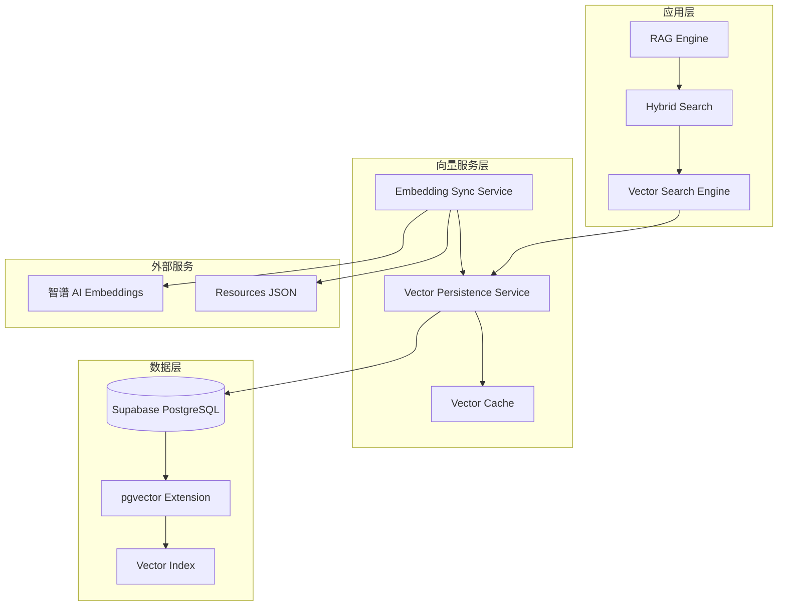

# Design Document: 向量化持久化 Supabase 方案

## Overview

本设计文档详细描述了基于 Supabase PostgreSQL + pgvector 的向量化持久化方案。该方案完全替换当前的纯内存向量索引，提供可扩展、高性能的语义搜索能力，解决冷启动、成本和扩展性问题。

## Architecture

### 系统架构图



### 核心组件

#### 1. Vector Persistence Service (VPS)
- **职责**: 向量数据的持久化存储和检索
- **接口**: 提供向量搜索、存储、更新、删除操作
- **特性**: 支持批量操作、缓存、错误处理

#### 2. Embedding Sync Service (ESS)
- **职责**: 资源数据与向量的同步管理
- **接口**: 增量同步、全量同步、状态检查
- **特性**: 智能变更检测、错误重试、日志记录

#### 3. Vector Cache Layer
- **职责**: 提供向量数据的内存缓存，提升查询性能
- **策略**: LRU 缓存、TTL 过期、预热机制
- **用途**: 减少数据库查询压力，提升响应速度

## Components and Interfaces

### 1. Vector Persistence Service

```typescript
interface VectorPersistenceService {
  // 向量搜索
  searchSimilar(
    queryEmbedding: number[],
    options: VectorSearchOptions
  ): Promise<VectorSearchResult[]>;
  
  // 批量向量搜索
  batchSearchSimilar(
    queries: VectorQuery[]
  ): Promise<VectorSearchResult[][]>;
  
  // 向量存储
  upsertEmbedding(
    resourceId: string,
    embedding: number[],
    metadata: ResourceMetadata
  ): Promise<void>;
  
  // 批量向量存储
  batchUpsertEmbeddings(
    embeddings: VectorEmbedding[]
  ): Promise<void>;
  
  // 向量删除
  deleteEmbedding(resourceId: string): Promise<void>;
  
  // 健康检查
  healthCheck(): Promise<HealthStatus>;
  
  // 性能统计
  getStats(): Promise<VectorStoreStats>;
}

interface VectorSearchOptions {
  limit?: number;
  minSimilarity?: number;
  categoryFilter?: string[];
  minRating?: number;
  includeMetadata?: boolean;
}

interface VectorSearchResult {
  resourceId: string;
  similarity: number;
  metadata?: ResourceMetadata;
}

interface VectorEmbedding {
  resourceId: string;
  embedding: number[];
  metadata: ResourceMetadata;
}

interface ResourceMetadata {
  category: string;
  rating: number;
  tags: string[];
  lastUpdated: Date;
  name: string;
  description: string;
}
```

### 2. Embedding Sync Service

```typescript
interface EmbeddingSyncService {
  // 增量同步
  syncIncrementalEmbeddings(): Promise<SyncResult>;
  
  // 全量同步
  syncAllEmbeddings(force?: boolean): Promise<SyncResult>;
  
  // 单个资源同步
  syncResourceEmbedding(resourceId: string): Promise<void>;
  
  // 检查同步状态
  getSyncStatus(): Promise<SyncStatus>;
  
  // 获取同步日志
  getSyncLogs(limit?: number): Promise<SyncLog[]>;
}

interface SyncResult {
  totalResources: number;
  processedResources: number;
  skippedResources: number;
  errorResources: number;
  duration: number;
  errors: SyncError[];
}

interface SyncStatus {
  lastSyncTime: Date;
  totalEmbeddings: number;
  pendingUpdates: number;
  isRunning: boolean;
}
```

### 3. Supabase Vector Store

```typescript
interface SupabaseVectorStore {
  // 数据库初始化
  initialize(): Promise<void>;
  
  // 创建表和索引
  createSchema(): Promise<void>;
  
  // 向量搜索（使用 SQL 函数）
  searchVectors(
    queryVector: number[],
    options: SearchOptions
  ): Promise<VectorMatch[]>;
  
  // 批量插入向量
  insertVectors(vectors: VectorRecord[]): Promise<void>;
  
  // 更新向量
  updateVector(
    resourceId: string,
    vector: VectorRecord
  ): Promise<void>;
  
  // 删除向量
  deleteVector(resourceId: string): Promise<void>;
  
  // 获取统计信息
  getVectorStats(): Promise<VectorStats>;
}

interface VectorRecord {
  resource_id: string;
  embedding: number[];
  metadata: Record<string, any>;
  created_at?: Date;
  updated_at?: Date;
}
```

## Data Models

### 1. 数据库架构

```sql
-- 启用 pgvector 扩展
CREATE EXTENSION IF NOT EXISTS vector;

-- 资源向量表
CREATE TABLE resource_embeddings (
  id SERIAL PRIMARY KEY,
  resource_id VARCHAR(255) UNIQUE NOT NULL,
  embedding vector(1024) NOT NULL,  -- 智谱 embedding-2 维度
  metadata JSONB NOT NULL DEFAULT '{}',
  created_at TIMESTAMP WITH TIME ZONE DEFAULT NOW(),
  updated_at TIMESTAMP WITH TIME ZONE DEFAULT NOW()
);

-- 创建向量索引（余弦相似度）
CREATE INDEX resource_embeddings_embedding_idx 
ON resource_embeddings 
USING ivfflat (embedding vector_cosine_ops)
WITH (lists = 100);

-- 创建资源ID索引
CREATE INDEX resource_embeddings_resource_id_idx 
ON resource_embeddings (resource_id);

-- 创建更新时间索引
CREATE INDEX resource_embeddings_updated_at_idx 
ON resource_embeddings (updated_at);

-- 创建元数据索引（类别）- 使用 BTREE 进行精确匹配
CREATE INDEX resource_embeddings_category_idx 
ON resource_embeddings 
USING BTREE ((metadata->>'category'));

-- 创建元数据索引（评分）
CREATE INDEX resource_embeddings_rating_idx 
ON resource_embeddings 
USING BTREE (((metadata->>'rating')::numeric));
```

#### 索引选择说明

**类别索引使用 BTREE 的原因：**
- **精确匹配优化：** 项目主要进行 `metadata->>'category' = 'color-tools'` 等精确匹配查询
- **少量类别：** 仅有 8 个固定类别，BTREE 索引效率更高
- **存储开销小：** 相比 GIN 索引，BTREE 占用更少存储空间
- **维护成本低：** 更新和维护开销较小

**如需支持文本搜索，可选择 GIN 索引：**
```sql
-- 启用 pg_trgm 扩展（如需模糊搜索）
CREATE EXTENSION IF NOT EXISTS pg_trgm;
CREATE INDEX resource_embeddings_category_gin_idx 
ON resource_embeddings 
USING GIN ((metadata->>'category') gin_trgm_ops);
```

### 2. 相似度搜索函数

```sql
-- 创建相似度搜索函数
CREATE OR REPLACE FUNCTION match_resources(
  query_embedding vector(1024),
  match_threshold float DEFAULT 0.3,
  match_count int DEFAULT 10,
  category_filter text[] DEFAULT NULL,
  min_rating float DEFAULT NULL
)
RETURNS TABLE (
  resource_id varchar(255),
  similarity float,
  metadata jsonb
)
LANGUAGE plpgsql
AS $$
BEGIN
  RETURN QUERY
  SELECT
    re.resource_id,
    1 - (re.embedding <=> query_embedding) as similarity,
    re.metadata
  FROM resource_embeddings re
  WHERE 
    1 - (re.embedding <=> query_embedding) > match_threshold
    AND (category_filter IS NULL OR re.metadata->>'category' = ANY(category_filter))
    AND (min_rating IS NULL OR (re.metadata->>'rating')::numeric >= min_rating)
  ORDER BY re.embedding <=> query_embedding
  LIMIT match_count;
END;
$$;
```

### 3. TypeScript 数据模型

```typescript
// Supabase 表类型定义
interface Database {
  public: {
    Tables: {
      resource_embeddings: {
        Row: {
          id: number;
          resource_id: string;
          embedding: number[];
          metadata: ResourceMetadata;
          created_at: string;
          updated_at: string;
        };
        Insert: {
          resource_id: string;
          embedding: number[];
          metadata: ResourceMetadata;
        };
        Update: {
          embedding?: number[];
          metadata?: ResourceMetadata;
          updated_at?: string;
        };
      };
    };
    Functions: {
      match_resources: {
        Args: {
          query_embedding: number[];
          match_threshold?: number;
          match_count?: number;
          category_filter?: string[];
          min_rating?: number;
        };
        Returns: {
          resource_id: string;
          similarity: number;
          metadata: ResourceMetadata;
        }[];
      };
    };
  };
}
```

## Correctness Properties

*A property is a characteristic or behavior that should hold true across all valid executions of a system-essentially, a formal statement about what the system should do. Properties serve as the bridge between human-readable specifications and machine-verifiable correctness guarantees.*

### Property 1: 向量数据一致性
*For any* 资源数据更新操作，向量存储中的对应向量数据应该与资源的最新状态保持一致
**Validates: Requirements 1.2, 1.3, 3.2**

### Property 2: 搜索结果相似度单调性
*For any* 向量搜索查询，返回的结果应该按照相似度降序排列，且所有结果的相似度都应该大于等于设定的阈值
**Validates: Requirements 4.2, 4.3**

### Property 3: 增量同步幂等性
*For any* 资源数据集合，多次执行增量同步操作应该产生相同的最终向量状态
**Validates: Requirements 3.1, 3.2, 3.3**

### Property 4: 向量存储持久化
*For any* 成功存储的向量数据，在系统重启后应该能够完整恢复并保持搜索功能正常
**Validates: Requirements 1.1, 1.4**

### Property 5: 错误处理完整性
*For any* 数据库连接或操作失败的情况，向量服务应该记录详细错误信息并抛出明确的异常，不应该静默失败
**Validates: Requirements 5.1, 5.2, 5.3**

### Property 6: 批量操作原子性
*For any* 批量向量操作，要么全部成功，要么全部失败，不应该出现部分成功的中间状态
**Validates: Requirements 1.5, 4.5**

### Property 7: 元数据过滤准确性
*For any* 带有元数据过滤条件的搜索查询，返回的所有结果都应该满足指定的过滤条件
**Validates: Requirements 4.4, 2.5**

### Property 8: 性能指标监控完整性
*For any* 向量服务操作，相关的性能指标（响应时间、成功率等）都应该被正确记录和统计
**Validates: Requirements 7.1, 7.2, 7.4**

## Error Handling

### 1. 数据库连接错误
- **检测**: 连接超时、认证失败、网络中断
- **处理**: 自动重试（指数退避）、记录详细错误日志、抛出明确异常
- **恢复**: 连接恢复后自动恢复服务

### 2. 向量搜索错误
- **检测**: 查询超时、索引损坏、维度不匹配
- **处理**: 记录错误详情、返回错误状态、触发告警
- **恢复**: 问题修复后自动恢复向量搜索

### 3. 同步服务错误
- **检测**: API 调用失败、数据格式错误、并发冲突
- **处理**: 错误重试、跳过问题资源、记录失败日志
- **恢复**: 定期重试失败的同步任务

### 4. 数据一致性错误
- **检测**: 向量与资源数据不匹配、重复记录、孤立数据
- **处理**: 数据校验、自动修复、手动干预接口
- **恢复**: 全量同步修复数据一致性

## Testing Strategy

### Unit Testing
- **向量存储操作**: 测试 CRUD 操作的正确性
- **相似度计算**: 验证搜索算法的准确性
- **同步逻辑**: 测试增量同步的边界条件
- **错误处理**: 模拟各种异常情况

### Property-Based Testing
- **Property 1**: 使用随机资源数据测试向量一致性
- **Property 2**: 生成随机查询验证搜索结果排序
- **Property 3**: 多次执行同步操作验证幂等性
- **Property 4**: 模拟系统重启测试数据持久化
- **Property 5**: 数据库连接异常测试错误处理
- **Property 6**: 随机批量操作测试原子性
- **Property 7**: 随机过滤条件测试准确性
- **Property 8**: 监控所有操作的性能指标

### Integration Testing
- **端到端流程**: 从资源更新到向量搜索的完整流程
- **数据库集成**: 与 Supabase 的实际交互测试
- **性能测试**: 大量数据下的搜索性能验证
- **并发测试**: 多用户同时访问的稳定性测试

### Configuration
- 每个属性测试运行最少 100 次迭代
- 使用真实的 Supabase 测试环境
- 集成 CI/CD 流水线自动执行测试
- 性能基准测试：搜索响应时间 < 100ms